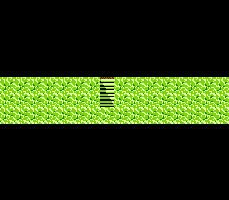

FC版FF3 プチDS化パッチ
=====================
DSがない…せや!ファミコンですればええんや!

## 概要
 このパッチはDS版FF3発売時まだDSを所持していなかった作者が、
 一部のジョブにDS版で新たに実装されたジョブ特性を実装したり、
 FC版でプレイ上の障害になるバグを修正したり、
 機能改善を行ったりして何とかしてDSみを感じたいなと思い立ち、
 心の赴くままに解析と実装を進めていたものです。

 なお、DS化と銘打ってはありますが、アイテム、敵モンスター、マップなど、
 基本はFC版FF3そのものです。

※画面は開発中のものです。

## パッチの入手
 最新のパッチは[published/release](published/release)にips形式/bps形式で置いていますのでダウンロードしてご利用ください。
 各形式のパッチともに、iNESヘッダ(v1. 16bytes)が存在するNESファイルを期待しています。
 リリースノートは[こちら](published/README.md)です。

## 大まかな方針
 [UFF3 Type-B](http://www.geocities.jp/uffmain/patchmain_frame.html),
 [FF3C v1](http://966-yyff.cocolog-nifty.com/blog/2013/05/post-70a9.html) を代表とした、
 本パッチをより進化させた改造FF3が世に生まれ、
 多くの年月も経た2017年現在、
 このパッチを直接遊ぶ必要性は薄いでしょう。
 
 それらの作品は、土台としてのFF3の味は残しつつも、
 現代的で、新しい気持ちで遊べるゲームになっていると私は思います。

 しかし、作者自身、未だに感慨を覚えることがあるのです。
 そうした作品の数々が生まれることは、当時の私は想像してはいなかった。

 パッチとともに提供していた雑多なメモ書きも人手を渡るうちにより洗練され、
 FF3++に付属する資料のような、解析する人の手に馴染む資料へと姿を変えたりしています。

 このパッチを礎として、別の作品が生まれ、世界が広がる可能性。
 それに目を向けるなら、このパッチの行く末も自ずから定められるでしょう。

### というわけで
+ ### 基本的に作者の審美眼と興味に基づき、気の向いたところを実装します
  + 審美眼とはいったい…
+ ### 当面はROM容量512k, マッパー[MMC3](https://wiki.nesdev.com/w/index.php/MMC3) を想定したコードにしておきます
  + 家を建てるにはまず基礎工事が必要です

## 開発の進め方
ToDoは[githubのissues](https://github.com/ypyp-pprn-mnmn/ff3_hack/issues)で管理しています。

### パッチの開発は大まかに次のステップのサイクルです
  1. エミュレータを利用して、興味のある処理を特定する
      + 最近は[Mesen(公式)](https://www.mesen.ca/ja/) [(@github)](https://github.com/SourMesen/Mesen)を利用しています
      + [fceux](http://www.fceux.com/web/home.html)も使っています
  2. 必要十分な解析を行う
      + 解析結果などは適宜[docs](docs)フォルダに放り込んでいます。
  3. [nesasm](https://github.com/camsaul/nesasm)の記法で、asmのソースコードを記述
  4. テスト&デバッグ
  5. ips/bps作成
      + 最近は[flips](https://github.com/Alcaro/Flips)を利用しています。

## Contributing
(　ﾟдﾟ) ・・・
　
(つд⊂)ｺﾞｼｺﾞｼ
　
(；ﾟдﾟ) ・・・
　
(つд⊂)ｺﾞｼｺﾞｼｺﾞｼ
　　_, ._
（；ﾟ Дﾟ） …！？

もし正気でしたら何がしたいかを添えてご一報ください。
