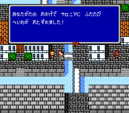

________________________________________________________________________________
# $3f:fff0 hardware_vectors
<details>

## code:
```js
{
	()	FF D6 
	()	FF 75 
	cop	FF F5 
	()	BF D7 
	abort	03 01 
	nmi	00 01 
	reset	48 FF 
	irq	03 01
}
$xx:0100 jmp $fb57
$xx:0103 jmp $fb30
```
</details>

________________________________________________________________________________
# $3e:c049 beginBattle
<details>

## args:
+	[in] $6a : encounter id
+	[in] $6b : background view (00-step 01-sand 07-mountain)
+	[in] $78 : world (00:"floating land")
## notes:
least value of S = $1c = $20 - 4
## code:
```js
{
	switchToBank3C();	//$c98a();
	$bc12();
	a = $6a;
	x = $6b;
	y = $78;
	call_doBattle();	//$f800();
	//carry = player party lost
	if (carry) { //bcc c05d
		return $c000();
	} else {
		switchToBank3C();	//$c98a();
		return $bc2d();
	}
}
```

</details>

________________________________________________________________________________
# $3e:c0ed
<details>

## code:
```js
{
	$c859();
	$cf9f();
	if ($6011 < 0) { //bpl $c108
		switchToBank3C();	//$c98a();
		$7f42 = #04;
		$7f49 = #88;
		$939b();
	}
	S = #ff;
	$c765();
	$43 = a & #20;
$c112:
	call_switch1stBank(per8k:a = #3a); //ff06

	waitNmiBySetHandler(); //ff00
//$34=scrollincrement,$4e=?

	$4014 = #02;	//dmaAddr.high (low=00)
	$8515();
	field_doScroll();	//$c389();	
	//...
$c150:
	$c1e4();	//=>c243,cd7e(getVehicleSpeed)
	switchToBank3C();	//$c98a();
	$3c:b78a();
	$3c:b7f9();
	$c486();
	$d83c();
	goto $c112();	//jmp
}
```

</details>

________________________________________________________________________________
# $3e:c1bb field::enterDungeon
<details>

## args:
+	[in] u8 $78 : world (00:floating land)
## code:
```js
{
	$7f49 = #93;	//SE
	$cf79();
	call_switch1stBank(per8k:a = #00);	//$ff06;
$c1c8:
	x = $45;
	if ($78 == 0) { //bne c1d4
$c1ce:
		a = $8800.x;
		//jmp c1d7
	} else {
$c1d4:
		a = $8840.x;
	}
	$48 = a;
	dungeon::mainLoop();	//e1dc
	return $c0ed();
}
```

</details>

________________________________________________________________________________
# $3e:c1f2
<details>

## code:
```js
{
	if ($23 != 0) $c269;	//start
$c1f9:	if ($22 != 0) $c258;	//select
$c200:	if ($24 != 0) $c2b7;
$c207:	if ($25 != 0) $c282;
$c20e:
	//...
}
```

</details>

________________________________________________________________________________
# $3e:c243 field::dispatchInput
<details>

## code:
```js
{
	if ($a9 == 0) { //bne c252
		floor::getInputOrFireObjectEvent(); //d219
		if (($20 & #0f) != 0) goto c253; //bne c253
		
		$4e = a;	//0
	}
$c252:
	return;
$c253:	//[上下左右]
	$33 = a;
$c255:
	return field_OnMove();	//$c4fc();	//jmp
}
```

</details>

________________________________________________________________________________
# $3e:c269 field_OnStart
<details>

## code:
```js
{
	$23 = 0;
	a = 0;
	$d469();	//fadeout?
	switchToBank3C();	//$c98a();
	$53 = 0;
	$3c:$a52f();
	return $c8e6();	//jmp
}
```

</details>

________________________________________________________________________________
# $3e:c389 field_doScroll
<details>

## code:
```js
{
	if ($34 != 0) { //beq c398
		$c416();	//=>c3c5
		if ($42 == 0) {
			return $c907();//jmp
		}
$c397:
		return;
	}
}
```

</details>

________________________________________________________________________________
# $3e:c398 field_setScroll
<details>

## code:
```js
{
	$2001 = #1e;
	$2000 = $ff = $fd;
	a = $2002;	//空読み
	$2005 = ($27 << 4) | $35;	//x
	$2005 = ($2f << 4) | $36;	//y
$c3be:
}
```

</details>

________________________________________________________________________________
# $3e:c3be
<details>

## code:
```js
{
	if ($32 != 0) {
$c3c2:
		$ca79();
	}
$c3c5:
	field_setScroll();	//$c398();
	a = ($35 + $34) & #0f;
	if (a != 0) { //beq c3d4
		$35 = a;
		return;
	}
$c3d4:
	$34 = $35 = a;	//a:0
	a = ($27 += 1);
	a = a & #10;
	$fd >>= 1;
	(a == #10);
	rol $fd;
	return;
}
```

</details>

________________________________________________________________________________
# $3e:c416
<details>

## code:
```js
{
}
```

</details>

________________________________________________________________________________
# $3e:c468
<details>
	$28--; //fieldY $20=inputBits
</details>

________________________________________________________________________________
# $3e:c4e6
<details>

## code:
```js
{
	$44 = $43; return;
$c4eb:
}
```
</details>

________________________________________________________________________________
# $3e:c4eb
<details>

## code:
```js
{
	$44 = $43;
$c4ef:
	if ($42 == 0) { //bne c4f9
		$c9ba();
		$b6da();
	}
$c4f9:
	return $ca67();
}
```

</details>

________________________________________________________________________________
# $3e:c4fc field::OnMove
<details>

## args:
+	[in] u8 $42 : vehicle 
	-	(0-歩行、1-チョコボ、2-カヌー 3-船、4-飛空艇、5-シドの飛空艇
		6-ノーチラス、7-インビンシブル) 未確認
+	[in] u8 a : input
## code:
```js
{
	if ((x = $42) < 2) { //bcs $c52b
		$c65d();
		if (!carry) { //bcs $c51b
$c507:
			if ($42 != 0) { //beq $c50f
				if ($44 < 0) $c4e6;	//bit bmi
			}
$c50f:
			if ($e4 != 0) $c4e6;
			$c603();
			if (carry) $c4e6;
$c518:
			goto $c4ef;
		}
$c51b:
		if ($42 != 0) $c4e6;	//bne
		$c5de();
		if (!carry) $c4eb;	//bcc
$c524:
		$c61b();
		if (!carry) $c4eb;	//bcc
		goto $c4e6();
	}
	//
$c52b:	//[ (x = $42) >= 2]
	if (equal) { // bne $c541
		//カヌー
		$c65d();
		if (!carry) $c4ef
		$c5b5();
		if (!carry) $c4eb
		$c61b();
		if (!carry) $c4eb
		goto $c4e6	//bcs
$c53e:
		goto $c4b8;	//jmp
	}
$c541:
	if (x == 3) { //bne c556
		$c65d();
		if (!carry) $c53e;
		$c5de();
		if (!carry) $c4eb;
		$c5b5();
		if (!carry) $c4eb;
		else $c4e6;	//bcs
	}
$c556:	//vehicle= 4,5,6,7
	$c65d();
	if (carry) $c4e6
	if ($78 != 0) { //beq c566
		if (a == 4) $c598;	//海中
		goto $c966;
	}
$c566:
	//浮遊大陸?
	if (x == #c8) { //bne c590
		$600c = $27;
		$600d = $28;
		$79 = #19;
		$7a = #d7;
		a = $6021 & #20;
		var temp = a < 1 ? 0 : 1
		$7b = 2 + temp;
		$44 = #c0;
		goto $c4ef;
	}
$c590:
	$c603();
	if (!carry) goto $c4ef;	//bcs c59b
$c598:	goto $c4ef;
$c59b:	goto $c4e6;
$c59e:
}
```

</details>

________________________________________________________________________________
# $3e:c65d
<details>

## args:
+	[in] u8 a : inputBits (see $3e:d281 field::getInput)
+	[in] u8 $27 : screen left (not character pos)
+	[in] u8 $28 : screen top ()
## code:
```js
{
	a >>= 1;
	if (carry) c674;
	a >>= 1;
	if (carry) c67b;
	a >>= 1;
	if (carry) c66d;
$c666:	//OnUp
	x = 7;y = 6; goto c67f;
$c66d:	//OnDown
	x = 7;y = 8; goto c67f;
$c674:	//OnLeft
	x = 8;y = 7; goto c67f;
$c67b:	//OnRight
	x = 6;y = 7;
$c67f:
	$82 = $80 = x + $27;
	$83 = y + $28;
	a = y + $2f;
	if (a >= #0f) { //bcc c697
$c695:
		a -= #0f;
	}
	$81 = a | #70;
	x = $80[y = 0] << 1;
$c6a1:
	$44 = $0400.x;
	$45 = $0401.x;	//used as entrance index on later
$c6ab:
	y = $42;
	//$c6cd: 01 03 02 04 10 10 10 10
	if ( ($c6cd.y & $44) != $c6cd.y) { //bne c6d5
		//return $c6d5();
		return field::OnCharacterMoved();	//c6d5
	}
	sec;
	return;
$c6b9:
}
```

</details>

________________________________________________________________________________
# $3e:c6b9 field
<details>

//	$44 < 0 && $45 >= 0
## args:
+	[in] u8 $42 : vehicle?
+	[in] u8 $78 : world
## code:
```js
{
	if ( ($78 != #04)  //beq c6cb
		&& $42 >= #04) //bcc c6cb
	{
$c6c5:
		//海中($78 == 4)でなく飛空艇に乗っている($42 >= 4)
		$44 &= #7f;	//イベント実行フラグクリア
	}
$c6cb:
	clc;
	return;
$c6cd:
}
```

</details>

________________________________________________________________________________
# $3e:c6d5 field::OnCharacterMoved
<details>

## code:
```js
{
	if ((a = $44) >= 0) { //bmi c6df
		a &= #40;
		if (a == 0) $c6cb;
		else $c6f7;
	}
$c6df:
	if ($45 >= 0) $c6b9; //bpl
//($45 & 80) != 0
	push (a = x);
	push ($82);
	push ($83);
	$c911();
	$83 = pop a;
	$82 = pop a;
	x = pop a;
	return;
$c6f7:
}
```

</details>

________________________________________________________________________________
# $3e:c711 field::getRandom
<details>

## code:
```js
{
	if ($f6 >= 0) { //bmi c71b
		$f5++;
	} else {
		$f5--;
	}
	if ($f5 == 0) { //bne c726
$c71f:
		$f6 += #a0;
	}
$c726:
	x = $f5;
	a = $fe00.x;
	return;
$c72c:
}
```

</details>

________________________________________________________________________________
# $3e:c72c floor::getObjectEventPtr
<details>

## args:
+	[in] u8 a : index (= $6c)
+	[out] ptr $72 : = $2c:8600[index]
## code:
```js
{
	y = a << 1;
	x = #86;
	if (carry) { //bcc c733
		x++;
	}
	$81 = x;
	$80 = 0;
	call_switch1st2Banks(per8kbase:a = #2c); //ff03
	$72,73 = $80[y,++y];
	$6c = 1;
	$17 = 0;
	return;
}
```

</details>

________________________________________________________________________________
# $3e:c750 field::callSoundDriver
<details>

## code:
```js
{
	call_switchFirst2Banks(per8kBank:a = #36); //ff03
	return $36:8003();
}
```

</details>

________________________________________________________________________________
# $3e:c966
<details>

## code:
```js
{
	if ( ($82 == #20) //bne c987
		&& ($83 == #e0) ) //bne c987
	{
$c972:
		$7b = 0;
		$79 = $600c;
		$7a = $600d;
		$44 = $7e = #c0;
$c986:
		return;
	} else {
$c987:
		return $c4ef;	//jmp
	}
}
```

</details>

________________________________________________________________________________
# $3e:c98a switchToBank3C
<details>

## code:
```js
{
	return switchFirst2Banks(per8kBank:a = #3c); //jmp ff03
}
```

</details>

________________________________________________________________________________
# $3e:c98f field::update_window_attr_buff
<details>

## args:
###
+	in u8 $37: skip_window_attr_update
+	in u8 $38: window_left (in 8x8)
+	in u8 $3b: window_row_in_draw (in 8x8)
+	in u8 $3c: window_width (in 8x8)
## code:
```js
{
	if ($37 == 0) { //bne c9b5
		$31 = $38 >> 1;
		$30 = $3b >> 1;
		$86 = $3c >> 1;
		$2d = 1;
		return field.merge_bg_attr_with_buff();	//$cab1();
	}
$c9a9:
}
```

</details>

________________________________________________________________________________
# $3e:c9a9 field::set_bg_attr_for_window
<details>

## args:
+	[in] u8 $37 :
+	[in] u8 $3c : palette entry count * 2
## code:
```js
{
	if ($37 == 0) { //bne c9b5
		x = $3c >> 1;
		x--;
		retun field::copyToVramWith_07d0();	//jmp cb6b
	}
$c9b5:
	return;
}
```

</details>

________________________________________________________________________________
# $3e:ca67
<details>

## code:
```js
{
	a = $2d >> 1;
	if (carry) { //bcc ca72
		$cda3();
	} else {
$ca72:
		$ccfb();
	}
$ca75:
	$caad();
	return;
}
```

//$3e:cab1 setPalatte
</details>

________________________________________________________________________________
# $3e:cab1 field::merge_bg_attributes_with_buffer
<details>

## args:
+	[in] u8 $2d : ??? (1 if caller is: $3e:c98f field::update_window_attr_buff)
+	[in] u8 $30 : tile.y (in 16x16) (== $3b >> 1)
+	[in] u8 $31 : tile.x (in 16x16) (== $38 >> 1)
+	[in] u8 $86 : width (in 16x16)  (== $3c >> 1)
+	[in] u8 $07c0[0x10] : colorId to set 
+	[in,out] u8 $0300[0x80] : attrtable cache
+	[out] u8 $07d0[0x10] : vram addr high
+	[out] u8 $07e0[0x10] : vram addr low
+	[out] u8 $07f0[0x10] : attr value
## code:
```js
{
	push ($31);
	push ($30);
	y = 0;
$cab9:
	a = $30 >> 1; //tile.y
	x = #0f;
	if (carry) { //bcc cac2
		x = #f0;
	}
	$80 = a << 3; //tile.y >> 1 << 3
	$81 = x; //palette mask for vertical
	a = $31; //offset x
	x = #23;	
	if (a >= #10) { //bcc cad5
		a &= #0f;
		x = #27;
	}
$cad5:
	$82 = x; //vram high
	x = #33;
	a >>= 1; //offset x
	if (carry) { //bcc cade
		x = #cc;
	}
$cade:
	$80 |= a; //(tile.y >> 1 << 3) | (tile.x >> 1)
	$81 &= x; //vertical mask & horizontal mask
	$07d0.y = $82;	//vram high
	$07e0.y = $80 | #c0; //vram low
	$07f0.y = $81; //attr mask
	if (($2d & #02) == 0) { //bne cb0f
		$31 = ($31 + 1) & #1f;
		if (++y < $86) { bcs cb24
			goto $cab9;
		}
	} else {
$cb0f:
		if ((a = $30 + 1) >= #0f) { //bcc cb1a
			a -= #0f;
		}
$cb1a:
		$30 = a;
		if (++y < #0f) { //bcs cb24
			goto $cab9;
		}
	}
$cb24:
	$30 = pop a;
	$31 = pop a;
$cb2a:
	x = $86; x--;
	if (($2d & #02) != 0) { //beq cb34
		x--;
	}
$cb34:
	for (x;x >= 0;x--) {
		if ( ($07d0.x & #04) == 0) { //bne cb43
			//BG 00
			a = $07e0.x & #3f;
		} else {
$cb43:			//BG 01
			a = $07e0.x & #3f | #40;
		}
$cb4a:
		y = a;
		$0300.y = $07f0.x = (($0300.y ^ $07c0.x) & $07f0.x) ^ $0300.y;
	}
	return;
$cb61:
}
```

</details>

________________________________________________________________________________
# $3e:cb6b field::copyToVramWith_07d0
<details>

## args:
+	[in] x : last entry (max = #0f)
## code:
```js
{
	$2002;
	for (x;x >= 0;x--) {
$cb6e:
		$2006 = $07d0.x;
		$2006 = $07e0.x;
		$2007 = $07f0.x;
	}
	return;
$cb84:
}
```

</details>

________________________________________________________________________________
# $3e:cba4 field::loadWarpDestinationFloor
<details>

## args:
+	[in] u8 $48 : warpId
+	[in] u8 $78 : world
//	u8 $00:8a00[0x100] : warp id => floor id for "floating land"
//	u8 $00:8b00[0x100] : warp id => floor id for "under world"
//	u16 $11:8000[0x100] : linear offset from $11:8000
## code:
```js
{
	call_switch1stBank(per8k;a = 00);	//ff06
	x = $48;
	if ($78 < 2) {
		//浮遊大陸
		a = $8a00.x;
	} else {
		a = $8b00.x;
	}
	y = a;
	call_switch1stBank(per8k:a = #11);	//ff06
	x = #80;
	a = y << 1;
	if (carry) { //bcc cbc4
$cbc3:
		x++;
	}
	$87 = x; //80 or 81
	y = a;
	$86 = 0;
	//$86: 8000/8100
	$80 = $86[y];
	push (a = $86[++y] );
	$81 = a & #1f | #80;
	//$80: 16bit linear offset from $11:8000(22000)
	a = #11 + ((pop a) >> 5);
	call_switchFirst2Banks(per8kBase:a );
	//
$cbe5:
	$82,83 = #7400;
	y = 0;
	loadFloorData();	//$cbfa();
$cbf2:
	call_switch1stBank(per8k:a = #3a);
	return $3a:8503();
}
```

</details>

________________________________________________________________________________
# $3e:cbfa loadFloorData
<details><summary>32x32のフロアデータを読み込む</summary>

## args:
+	[in] y : initial offset
+	[in] ptr $80 : src
+	[in] ptr $82 : dest (7400)
## code:
```js
{
		if ((a = $80[y] ) < 0) { //bpl cc2a
$cbfe:		//repeated
			$84 = a & #7f;	//chipId
			$80,81++;
			x = $80[y];	//repeat count
			a = $84;
			for (x;x != 0;x--) {
$cc0d:
				$82[y] = a;
				y++;
			}
$cc13:
			if ((a = y) != 0) { //beq cc1f
				$82 += a;
				if (!carry) $cc38 //bcc cc38
			}
			if (++$83 >= #78) cc41 //bcs cc41
			//jmp $cc38
		} else {
$cc2a:
			$82[y] = a;
			if (++$82 == 0) {//bne cc38
				if (++$83 >= #78) cc41 //bcs cc41
			}
		}
$cc38:
		$80,81++;
	}
$cc41:
	return;
}
```

</details>

________________________________________________________________________________
# $3e:cc47 field::loadMapRow
<details>

## code:
```js
{
	field::getMapDataPointers();	//$ccbb();
	for ($82;;) {
		if ( (a = $80[y = 0] ) < 0) { //bpl cc73
$cc50:
			$84 = a & #7f;
			$80,81++;
			x = $80[y];
			a = $84;
			for (x;x != 0;x--) {
$cc5f:
				$82[y++] = a;
			}
			if ((a = y) != 0) { //beq cc82
				y = 0;
				$82 += a;
				//bcc cc79 bcs cc82
			}
		} else {
$cc73:
			$82[y] = a;
			$82++;
		}
		if ($82 == 0) break;  //beq cc82
		$80,81++;
	}
$cc82:
	return;
}
```

</details>

________________________________________________________________________________
# $3e:ccbb field::getMapDataPointers
<details>

## args:
+	[out] ptr $82 : pDest
+	[out] ptr $80 : pSrc
+	[in] u8 $2c : y?
+	[in] u8 $30 : offset y from top?
+	u16 $06:9000[0x400] : linear offset from $06:9000( 0d000 )
	cc42: 90 90 92 94 96
+	u8 $78 : world (浮遊大陸//浮上前/浮上後/海中)
## code:
```js
{
	call_switch1stBank(per8k:a = #06);	//ff06
	$87 = $cc42.(x = $78);
	$86 = 0;
	a = $2c << 1;
	if (carry) { //bcc ccd2
		$87++;
	}
$ccd2:

	y = a;
	$80 = $86[y]; //*$86: linear offset from $06:9000 (0d000)
	push (a = $86[++y] + #10);
	$81 = a & #1f | #80;
	a = (pop a >> 5) + #06;
	
$cceb:
	call_switch2banks(per8kBase:a );	//ff03
	$83 = #70 | $30;
	$82 = #00;
	return;
}
```

</details>

________________________________________________________________________________
# $3e:cd76 vehicleSpeeds[] =
<details>

## code:
```js
{
	01 02 01 02 04 02 08 02
}
```

</details>

________________________________________________________________________________
# $3e:cd7e getVehicleSpeed
<details>

## args:
+	[in] u8 $42 : vehicle
+	[in] u8 $78 : world
+	[out] u8 $34 : speed (pixel per frame)
+	[in,out] u8 $4e : apply delay (0=yes)
## code:
```js
{
	if ($78 >= 4) { //bcc cd88
		a = 1; //bne cd8d
	} else {
$cd88:
		x = $42;
		a = $cd76.x;
	}
$cd8d:
	$34 = a;
	if (a != #8) { //beq cd98
		$4e = 0;
		return;
	}
$cd98:	//ノーチラスは8
	if ($4e == 0) { //bne $cda2
		$4e++;	
		$34 = 4;//1回だけ増分を4にする
	}
$cda2:
	return;
$cda3:
}
```

</details>

________________________________________________________________________________
# $3e:ce7a getTileParamsVertical
<details>

## args:
+	[in] ptr $80 : pMapData (7000-7eff)
## code:
```js
{
	for (x;x < #10;x++) {
		y = $80[y = 0];
		$0780.x = $0500.y;
		$0790.x = $0580.y;
		$07a0.x = $0600.y;
		$07b0.x = $0680.y;
		$07c0.x = $0700.y;
		$81 = #70 | ((($81 + 1) & #0f) % #0f); //cmp #$0f, bcc, sbc #$0f
	}
}
```

</details>

________________________________________________________________________________
# $3e:d1b1 field::loadString
<details>

## args:
+	[in] a : string id (ptrTable = $30200)
+	[out] u8 $7b00 : = 0
+	[out] string $7b01
## code:
```js
{
	push a;
	call_switchFirst2Banks(per8kbank:a = #18);	//ff03
	$82,83 = #8200;
	y = pop a << 1;
	if (carry) { //bcc d1c6
		$83++;
	}
$d1c6:
	$80 = $82[y]; y++;
	push (a = $82[y] );
	$81 = a & #1f | #80;
	
	a = (pop a >> 5) + #18;	//high>>5+#18
	call_switchFirst2Banks(per8kbank:a );

	$7b00 = y = 0;
$d1e5:
	do {
		if ( ($80[y] < #28) //bcs d200
$d1eb:			&& ($80[y] >= #10) ) //bcc d200
		{
			if ($80[y] == #10) //bne d1f3
$d1f1:
				a = $9e;
			}
$d1f3:
			$7b01.y = a; y++;
			$7b01.y = $80[y];
			continue; //jmp $d1e5
		}
$d200:
		$7b01.y = a; y++;
	} while (a != 0); //bne d1e5
$d208:
	return call_switchFirst2Banks(per8kBank:a = #3c);	//jmp ff03
}
```

</details>

________________________________________________________________________________
# $3e:d219 floor::getInputOrFireObjectEvent
<details>

## args:
+	[in] ptr $72 : object event param ptr
## code:
```js
{
	if ($6c == 0) return field::getAndMaskInput(); //$d27a;
	if ($17 != 0) { //beq d226
		$17--;
		//return $d26d();
	} else {
$d226:
		call_switch1st2Banks(per8kbase:a=#2c); //ff03
		if ($72[y = 0] == #fe) { //bne d24c
			$17 = $72[++y];
			$17--;
			$72,73 += #0002;
			return call_switch1st2banks(per8kbase:a=#3c);
		}
$d24c:
		$70 = a;
		$71 = $72[++y];
		x = 1;
		if ( ((a = $70) >= #e4) //bcc d261
			&& (a < #fd) ) //bcs d261
		{
			x = 2;
		}
$d261:
		$72,73 += x;
	}
$d26d:
	call_switch2ndBank(per8k:a = #3b); //ff09
	floor::call_dispatchObjectEvent(); //$3b:a000();
	return call_switch1st2Banks(per8kbase:a = #3c); //ff03
}
```

</details>

________________________________________________________________________________
# $3e:d27a field::getAndMaskInput
<details>

## code:
```js
{
	field::getInput();	//d281
	field::maskInput();	//d29a
	return;
$d281:
}
```

</details>

________________________________________________________________________________
# $3e:d281 field::get_input
<details>

## args:
+	[out] u8 $20 : inputBits (bit7< A B select start up down left right >bit0)
## notes:
bitの配置が戦闘中のルーチンと逆
## code:
```js
{
	$4016 = 1; $4016 = 0;
	for (x = 8;x != 0;x--) {
		a = $4016 & 3;
		carry = (a < 1) ? 0 : 1
		rol $20;
	}
	return;
$d29a:
}
```

</details>

________________________________________________________________________________
# $3e:d29a field_maskInput
<details>

## code:
```js
{
	if ( ($20 & 3) != 0) { //beq d2a2
		x = 3;
	}
$d2a2:
	$81 = x;
	if (($20 & #c) != 0) { //beq $d2af
		$81 = x | #c;
	}
$d2af:
	x = $21 = a = (($20 ^ $21) & $81) ^ $21;
	if ((a & #10) != 0) { //beq $d2ce
		if (($20 & #10) != 0) { // beq d2c8
			$23++;
		}
		$21 ^= #10;
	}
$d2ce:
	a = x & #20;
	if (a != 0) { //beq $d2e1
		if (($20 & #20) != 0) { //beq d2db
			$22++;
		}
$d2db:
		$21 ^= #20;
	}
$d2e1:
	a = x & #40;
	if (a != 0) { //beq $d2f4
		if (($20 & #40) != 0) { //beq d2ee
			$25++;
		}
		$21 ^= #40;
	}
$d2f4:
	a = x & #80;
	if (a != 0) { //beq $d307
		if (($20 & #80) != 0) { //beq d301
			$24++;
		}
		$21 ^= #80;
	}
$d307:
	return;
}
```

</details>

________________________________________________________________________________
# $3e:d308
<details>

## code:
```js
{
}
```

</details>

________________________________________________________________________________
# $3e:d381 loadPalette
<details>

## code:
```js
{
	$2002;
	$2006 = #3f;
	$2006 = #00;	
	for (x = 0;x < #10;x++) {
$d390:
		$2007 = $03f0.x;
	}
	$2002;
	$2006 = #3f; $2006 = #00;
	$2006 = #00; $2006 = #00;
	return;
$d3af:
}
```

</details>

________________________________________________________________________________
# $3e:d4a2
<details>

## code:
```js
{
	if (($8c & 4) != 0) { //beq d4bb
		$2000 = #ff;
		$2001 = #a;
		$2005 = 0; $2005 = 0;
		return;
	}
$d4bb:
	if (($8c & 2) == 0) { //beq d4c7
		$c398();
		goto $d7ca();
	} else {
$d4c7:
		$e571();	//field_sync_ppu_scroll_with_player	
	}
$d4ca:
	$2001 = #a;
	return;
}
```

</details>

________________________________________________________________________________
# $3e:d83c
<details>

## args:
+	[in] u8 $42 : vehicle
## code:
```js
{
	y = $42
	$d8d3();
	return $d85a();
}
```

</details>

________________________________________________________________________________
# $3e:d85a
<details>

## args:
+	[in] u8 $78 : world
## code:
```js
{
	//...
$d899:	//[下の世界]
	
}
```

</details>

________________________________________________________________________________
# $3e:da3a floor::loadObjectSprite
<details>

## args:
+	[in] ptr $80 : building info (= $700e.x,$700f.x + 0|8 + $7105.x)
	++	$700e.x :
			objparam.+03 & 3 == 0 : #b43a
			objparam.+03 & 3 == 1 : #b44a
			objparam.+03 & 3 == 2 : #b42a
			objparam.+03 & 3 == 3 : #b41a
	++	$7105.x :
			(objparam.+03 << 4) & #c0
+	[in,out] u8 $26 : sprite offset
+	[in] u8 $82 : tile index offset
## code:
```js
{
	y = 0;
	x = $26;
	$0200.x = $0204.x = a = $41; //sprite.x
	$0208.x = $020c.x = a + 8;
	$0203.x = $020b.x = a = $40; //sprite.y
	$0207.x = $020f.x = a + 8;
	$0201.x = $80[y] + $82;	//sprite.tileIndex
	$0202.x = $80[++y];	//sprite.attribute
	$0209.x = $80[++y] + $82;
	$020a.x = $80[++y];
	$0205.x = $80[++y] + $82;
	$0206.x = $80[++y];
	$020d.x = $80[++y] + $82;
	$020e.x = $80[++y];
	$26 += #10;
	return;
$daa3:
}
```

</details>

________________________________________________________________________________
# $3e:dd06
<details>

## code:
```js
{
	$dfd6();
	field::callSoundDriver();
	return $dff8();
}
```

</details>

________________________________________________________________________________
# $3d:ddc6
<details>

## code:
```js
{
	call_switch2Banks(per8k:a = #0a); //ff03
	$80,81 = #8c00;
	loadPatternToVramEx(vramHigh:a = #00,per100hlen:x = #08); //de0f
	if ( ($6011 < 0)  //bpl ddf6
		&& ($78 == #03)) //bne ddf6
	{
		call_switch1stBank(per8k:a = #3a); //ff06
		clc;
		$3a:8518();
		call_switch2Banks(per8k:a = #3c); //ff03
		return $3c:94ff();
	}
$ddf6:
	$80,81 = #9400 + (($78 & #06) << 10);
	loadPatternToVram(per100hlen:x = #08); //de1a
	call_switch1stBank(per8k:a = #3a);
	clc;
	return $3a:8518();
}
```

</details>

________________________________________________________________________________
# $3e:de0f loadPatternToVramEx
<details>

## args:
+	[in] u8 a : vramAddrHigh (low=00)
## code:
```js
{
	bit $2002;
	$2006 = a; $2006 = 0;
}
```
</details>

**fall through**
________________________________________________________________________________
# $3e:de1a loadPatternToVram
<details>

## args:
+	[in] u8 x : len (per256bytes)
+	[in] ptr $80 : pPattern
## code:
```js
{
	y = 0;
	for (x;x != 0;x--) {
		do {
$de1c:
			$2007 = $80[y];
		} while (++y != 0);
		$81++;
	}
	return;
$de2a:
}
```
</details>

________________________________________________________________________________
# $3e:de2a loadSmallPatternToVram
<details>

## args:
+	[in] ptr $80 : pattern
+	[in] u8 x : len
+	[in] u8 y : offset
## code:
```js
{
	do {
		$2007 = $80[y++];
	} while (--x != 0);
	return;
$de34:
}
```
</details>

________________________________________________________________________________
# $3e:de5a floor::loadPatternForTiles
<details>

## args:
+	[in] u8 $48 : warpId
+	[in] u8 $78 : world
+	$00:8c00[2][0x100] : tileSetId (index = warpId)
+	ptr $00:8e00[0x30][0x8] : pTilePattern (index = tileSetId)
## code:
```js
{
	call_switchFirst2Banks(per8k:a = 00); //ff03
	x = $48;
	if ($78 < #02) {
		a = $8c00.x;
	} else {
		a = $8d00.x;
	}
$de6d:
	$8c,8d = #8e00 + (a << 4);
	for (y = #0f;y >= 0;y--) {
		$7f00.y = $8c[y];
	}
$de8c:
	$8e = 0;
	$2002;
	$2006 = 0; $2006 = 0;
	for ($8e;$8e < 8;$8e++) {
$de9b:
		y = $8e << 1;
		$80 = $7f00.y;
		push (a = $7f01.y);
		$81 = a & #1f | #80;
		a = (pop a >> 5) + 3;
$deb7:
		call_switchFirst2Banks(per8k:a );
		x = $8e;
		x = $df00.x;	//
		y = 0;
		loadTilePatternToVram();	//$deea();
	}
$decd:
	call_switch1stBank(per8k:a = #3a); //ff06
	sec;
	$3a:8518();
$ded6:
	call_switch1stBank(per8k:a = #0d); //ff06
	$80,81 = #9700;
	x = #09;
	a = #07;
	return loadPatternToVramEx();	//$de0f();
$deea:
}
```

</details>

________________________________________________________________________________
# $3e:deea loadTilePatternToVram
<details>

## args:
+	[in] x : tileCount
+	[in] ptr $80 : pPattern
## code:
```js
{
	for (x;x != 0;x--) {
$deee:
		for ($82 = #10;$82 != 0;$82--) {
			$2007 = $80[y];
			if (++y == 0) { //bne def8
				$81++;
			}
$def8:
		}
$defc:
	}
	return;
$df00:
}
```

</details>

________________________________________________________________________________
# $3e:df00
<details>

## code:
```js
{
	1a 08 08 0e  08 10 10 10
}
```
</details>

________________________________________________________________________________
# $3e:df08 floor::loadObjectPatterns
<details>

## args:
+	[in] u8 $78 : world
## code:
```js
{
	$8c,8d = #9400 + ($78 >= 2 ? #100 : 0);
	$8a = $8b = 0;
$df1a:
	do {
		floor::loadObjectPattern();	//$df41
		$8b += #10;
	} while (++$8a < #0c); //bcc df1a
$df2c:
	call_switch1stBank(per8k:a = #0d); //ff06
	$80,81 = #9400;
	reurn loadPatternToVramEx(ptr:$80, vramHigh:a = #1e, lenHigh:x = #02); 
}
```

</details>

________________________________________________________________________________
# $3e:df40
<details>

## code:
```js
{
	return;
}
```
</details>

________________________________________________________________________________
# $3e:df41 floor::loadObjectPattern
<details>

## args:
+	[in] u8 $8a : vramoffset high (base = #1200)
+	[in] u8 $8b : objectOffset
+	[in] ptr $8c : objectIdToPatternIndexMap ($00:9400-)
## code:
```js
{
	if ((a = $700a.(x = $8b)) == 0) return; //beq df40
	y = a;
	call_switch1stBank(per8k:a = #00); //ff06
	if( (a = $8c[y]) < #40) { //bcs df6b
$df54:
	//size=100h
	//前、後ろ、左1、左2
		$80,81 = #8000 + (a << 8);
		call_switchFirst2Banks(per8kBase:a = #0e); //ff03
		x = #01;
		a = $8a + #12;
		return loadPatternToVramEx(); //de0f
	}
$df6b:	else if (a < #58) { //bcs df9f
	//同パターン{前後}x2, size=80h
		$80,81 = #8000 + ( (a - #40) << 7 ); //lsr,ror
		call_switch1stBank(per8k:a = #0a); //ff06
		x = #80;
		y = 0;
		bit $2002;
		$2006 = $8a + #12;
		$2006 = 0;
		loadSmallPatternToVram(len:x, offset:y ); //de2a
		return loadSmallPatternToVram(len:x = #80, offset:y = #00); //$de2a();
	} else {
$df9f:	//同パターンx4, size=40h
		$80,81 = #8800 + ((a - #58) << 6);
		call_switch1stBank(per8k:a = #0d); //ff06
		bit $2002;
		$2006 = $8a + #12;
		$2006 = 0;
		$dfcf();
		$dfcf();
		$dfcf();
$dfcf:
		return loadSmallPatternToVram(len:x = #40, offset:y = #00); //$de2a();
	}
$dfd6:
}
```

</details>

________________________________________________________________________________
# $3e:dfd6
<details>

## code:
```js
{
	$ded6();
	$81 = #95;
	a = #5;
	x = #2;
	loadPatternToVramEx();
	a = 0;
	$2006 = a;
	$2006 = a;
	for (x = #10;x != 0;x--) {
		$2007 = a;
	}
$dff8:
}
```

</details>

________________________________________________________________________________
# $3f:e1dc dungeon::mainLoop
<details>

## args:
	least value of S = $1e = $20 - 2
+	[in] u8 $48 : warpId
## code:
```js
{
	a = #0;
	dungeon::loadFloor();	//$e7ec();
$e1e1:

	call_switch1stBank(a = #3a); //ff06
	waitNmiBySetHandler();	//ff00
	$4014 = #02;

	$3a:8515();
	$e54c();
	$f0,f1 += #0001;
	field::callSoundDriver();

	if ($36|$35 == #08) {
		$e900();	//checks event ?
	}
	if ( ($34 == 0) //bne e229
		&& ($76 == 0) //bne e229
	{
$e217:
		if (($ab & #e0) != 0) goto $e26a; //beq e220
$e220:
		if ( ($76 | $a9) == 0) { //bne e229
$e226:
			floor::getInputAndHandleEvent();	//$e2f8();	//getinput
		}
	}
$e229:
	if ( ($a9 == 0)	//bne e23a
		&& ($76 != 0) //beq e23a
	{
$e231:
		$92 = a;
		$76 = 0;
		$ec8b();
	}
$e23a:
	switch1stBankTo3C();	//$eb28();
	$3c:b78a();
	$3c:c486();
	$d844();
	switch1stBankTo3C();	//$eb28();
	$3c:b7f9();
	if ($4b == #ff) goto $e1e1; //beq
$e252:
	//4b = areaNameId/ stringIndex based from $30200
	$94 = 0;
	$92 = $4b;
	$95 = #82;	//94: #8200
	$4b = #ff;
	a = #4;
	$ec8d();
	goto $e1e1();

$e26a:	// (a = ($ab & #e0)) != 0

	if (a < #40) { //bcs e28b
		//encounter!
$e26e:
		$d34d();	//flash screen
		$e283();
		beginBattle();	//$c049();	//process battle(call battleLoop)
		a = 1;
		$e7f8(); //this clears encount flag
		$4b = #ff
		goto $e1e1;
	}
$e283:
	a = #3a;
	call_switch1stBank(); //ff06
	return $3a:8533();
$e28b:	// ($ab & #e0) >= #40
	if (a == #40) { //bne e295
	//warp back?
		a = #94;
$e28f:
		$7f49 = a;	//soundDriver_effectId
		return $d08c();
	}
$e295:
	if (a == #80) { //bne e2ce
$e299:	//warp forward?
		x = S;	//stack pointer
		if (x < #20) goto $e220(); //bcs e2a1
$e2a1:
		push ($29);
		push ($2a);
		push ($48);
		$e28f(a = #93);	//set SE

		x = $45 & #0f;	//warpIndex
		$48 = $0700.x;	// warpId
		dungeon::mainLoop();	//$e1dc(); recursive call
$e2bc:
		$48 = pop a;
		$2a = pop a;
		$29 = pop a;
	}
}
```

</details>

________________________________________________________________________________
# $3f:e2f8 floor::getInputAndHandleEvent
<details>

## code:
```js
{
	if ($50 != 0) { //beq e32e
		a = #02;
		$d469();
		if ($50 < 0) { //bpl e31f
$e305:
			if ($50 == #80) {//bne e314
$e309:
				call_switchFirst2Banks(per8kbank:a = #1e); //ff03
				$1f:bff7();
				//goto $e325
			} else {
$e314:
				call_switchFirst2Banks(per8kbank:a = #1e); //ff03
				$1f:bffa();
				//goto $e325
			}
		} else {
$e31f:
			switch1stBankTo3C();	//$eb28();
			$3c:af1f();
		}
$e325:
		$50 = 0;
		return $e7f8(a = 1);
	}
$e32e:
	if ($6c == 0) { //bne e36e
		if ( $24 != 0 ) { //beq e339
			return floor::getEvent(); //ea26 this will set $6c
		}
$e339:
	//...
	}
$e36e:	//($6c != 0)
	if ($4b != #ff) { //bne e37d
		return;
	}
$e374:
	floor::getInputOrFireObjectEvent(); //$d219();	//getAndMaskInput
	if ( ($20 & #0f) == 0) { //bne e37e
$e37d:
		return; 
	}
$e37e:	//十字キーのどれかが押されてる
	$33 = a;
	floor::fireOnMove();	//$e396();
	if (carry) return;	//bcs e37d
$e385:
	switch1stBankTo3C();	//$eb28();
	$3c:b6da();
	$6021 &= #bf;
	return $ca67();
}
```

</details>

________________________________________________________________________________
# $3f:e396 floor::fireOnMove
<details>

## args:
+	[out] bool carry : ?
## code:
```js
{
	floor::getEventSourceCoodinates(); //$e4e9();
	$e3f1();	//handle move/collision?
	if (!carry) { //bcs $e3e5
$e39e:
		floor::getChipEvent();	//$e51c();
		//$44 = 80:event? 40:encountable?
		if ($44 >= 0) { //bmi $e3d0;
			if (($44 & #40) != 0) { //bvc e3b4
$e3a9:
				call_switch2ndBank(per8k:a = #3d);
				sec;
				$3d:bc5b();	//checkEncounter
				a = $44;
			}
$e3b4:
			a &= 7;
			if (a != 0) { //beq e3ca
				if (a < 4) { //bcs e3c8
					if (a == 3) $e3e5; //beq
					a |= $a5;
					if (a == 3) $e3e5; //beq
					$a5 = a;
				}
				clc;
				return;
			}
$e3ca:
			$a5 = 0;
			clc;
			return;
		}
$e3d0:	//event
		x = ($45 >> 4) << 1;	//note: not >>3 (always lsb = 0)
		$80,81 = $e669.x,$e66a.x;	//3f:e669 (7e669)
	//e669:
	//	89 E6  8F E6  B9 E6  B9 E6
	//	95 E6  9B E6  A8 E6  B9 E6
	//	B9 E6  B9 E6  B9 E6  B9 E6
	//	B3 E6  B3 E6  B3 E6  BE E6
		return (*$80)();
	}
$e3e5:
	$45 = $ab = 0;
	$44 = $43;
	sec;
	return;
}
```

</details>

________________________________________________________________________________
# $3f:e4e9 floor::getEventSourceCoodinates
<details>

## args:
+	[in] a : input bits?
+	[out] $84 : mapX
+	[out] $85 : mapY
## code:
```js
{
	a >>= 1;
	if (carry) e500
	a >>= 1;
	if (carry) e507
	a >>= 1;
	if (carry) e4f9
$e4f2:
	x = 7; y = 6; goto e50b;
$e4f9:
	x = 7; y = 8; goto e50b;
$e500:
	x = 8; y = 7; goto e50b;
$e507:
	x = 6; y = 7;
$e50b:
	$84 = ($29 + x) & #3f;
	$85 = ($2a + y) & #3f;
}
```

</details>

________________________________________________________________________________
# $3f:e51c floor::getChipEvent
<details>

## args:
+	[in] u8 $84,$85 : chip position(x,y)
+	[ou] y : chipId
+	[out] u8 $44 : chip attributes (80:event 40:encountable? 08:damage)
+	[out] u8 $45 : [hhhhiiii] h : eventId(index of handler), i: eventParam(serial number)
## code:
```js
{
	y = $4c;
	a = ($84 | $85) & #20;
	if (a == 0) { //bne e541
		//マップの範囲内
		$81 = #74 | (($85 & #1f) >> 3);
		$80 = ($85 << 5) | $84;
		y = $80[y = 0];	//y = chipID
	}
$e541:	
	$44 = $0400.y;
	$45 = $0500.y;
	return;
}
```


</details>

________________________________________________________________________________
# $3f:e695
<details>

## code:
```js
{
	$ab = #80;	//80:warp forward
	clc;
	return;
}
```

</details>

________________________________________________________________________________
# $3f:e69b floor::event05? //[warp?]
<details>

## code:
```js
{
	$7f49 = #83;	//7f49:soundDriver_effectId
	a = #7e;
	$e6f2();
	return $e695();
}
```

</details>

________________________________________________________________________________
# $3f:e6be floor::event07
<details>

## code:
```js
{
	x = $45 & #0f;
	push (a = $0720.x);
	switch1stBankTo2C();	//$eb23();
	x = pop a << 1;
	$82,83 = $8880.x,$8881.x;

	$ea1b();	//*$82 => 7b00
	switch1stBankTo3C();	//$eb28();
	$3c:9274();
	$3c:9319();
	$e9dd();
	$2d >> 1;
	if (carry) goto $e714; //bcc e714
$e6eb:
	a = $44;
	return $e3b4();
}
```

</details>

________________________________________________________________________________
# $3f:e6f2
<details>

## code:
```js
{
	$0d = a;
	x = 7;
	if (($33 & #0c) != 0) { //beq e704
		x = 8;
		if (a != 4) { //beq e704
			x = 6;
		}
	}
$e704:
	a = x + $2f;
	if (a >= #0f) { //bcc e70e
		a -= #0f;
	}
$e70e:
	$0f = a;
	$0e = $84;
	return;
$e715:
}
```

</details>

________________________________________________________________________________
# $3f:e7ec dungeon::loadFloor
<details>

## code:
```js
{
	dungeon::loadFloorData();	//$e803();
	$e811(); //loadObjects
	$e81b();
	return $d066();
}
```


</details>

________________________________________________________________________________
# $3f:e803 dungeon::loadFloorData
<details>

## code:
```js
{
	$aa = a;
	$2d = 1;
	$2001 = 0;
	return field::loadWarpDestinationFloor();	//$cba4();
}
```

</details>

________________________________________________________________________________
# $3f:e811
<details>

## code:
```js
{
	call_switch2ndBank(per8k:a = #3b);	//ff09
	x = #07;
	return $3b:a003();
}
```

</details>

________________________________________________________________________________
# $3f:e81b
<details>

## code:
```js
{
	$37 = 0;
	$2001 = 0;
	$22 = $23 = $24 = $25 = $ab = 0;
	$dd0f();
	call_switch1stBank(per8k:a = #3a);	//ff06
	$3a:8509();
	push (a = $33);
	$ca25();
	$33 = pop a;
	//...
}
```

</details>

________________________________________________________________________________
# $3f:e8a5
<details>

## args:
+	[out] u8 $f8 : encounter bound
## code:
```js
{
	//...
	call_switch2ndBank(per8k:a = #39);
$e8aa:
	x = $48;
	if ($78 != 0) {
		a = $bf00.x;
	} else {
		a = $be00.x;
	}
	$f8 = a;
	//...
}
```

</details>

________________________________________________________________________________
# $3f:e917 floor::processChipEvent
<details>

## args:
+	[in] u8 $49 : warpparam.+01 & 0x20
+	[out] bool carry : event fired (1=yes)
+	[out] u8 a : message id?
## code:
```js
{
	floor::getChipEvent();	//$e51c();
	if ($44 < 0) { //bpl e95e
		a = y;	//y: chipId
		if (a < #90) e95e;
		if (a < #a0) e968;
		if (a < #d0) e95e;
		if (a >= #f0) e95e;
$e92f:		//chipId:d0-ef
		$ba = x = 0;
		if (a < #e0) return OnTreasure(); //bcc e982
		
		//chipId:e0-ef
		$ba--;
		x = $45 & #0f;
		push (a = $0710.x);	//treasureId
		x = a & 7;
		y = a >> 3;
		if ($78 != 0) {	//78=world
			y += #20;
		}
$e953:
		if (($e960.x & $6040.y) == 0) return OnTreasure(); //$e982();
	}
$e95e:
	clc;
	return;
$e960:
	01 02 04 08 10 20 40 80
$e968:	//#90 <= chipId < #a0
	x = $600e; //先頭キャラオフセット?
	if ($6100.x; != #08) { //beq e976
	//job == thief
		a = #03;
		sec;
		return;
	}
$e976:
	$6021 |= #40;
	a = #7a;
	sec;
	return;
}
```

</details>

________________________________________________________________________________
# $3f:e982 OnTreasure
<details>

## args:
+	[in] u8 $ba : 00: chipId=d0-df ff:chipId=e0-ef
## code:
```js
{
	$7f49 = #bf;
	if ($ba >= 0) { //bmi e98e
		$e6f0();
	}
	push16 ($80);
	getTreasure(); //f549
	x = a;
	$80 = pop16;
	a = x;
	if (a == #50) { //bne e9ad
		$0d = $44 = 0;
		a = #50;
$e9ab:
		sec;
		return;
	}
$e9ad:
	if ($ba < 0) return $e9ab; //bmi e9ab
	x = a;
	$80[y = 0] = #7d;
	a = x;
	sec;
	return;
$e9bb:
}
```

</details>

________________________________________________________________________________
# $3f:e9bb floor::getObjectEvent
<details>

## args:
+	[in] u8 x : object offset
## code:
```js
{
	$44 = $43;
	$a0 = $7000.x;
	x = #82;
	if ($78 != 0) {
		x = #84;
	}
	a = $a0;
	floor::loadEventScriptStream();	//$ea04()
	if ($a0 < #e0) { //bcs e9e8
		switch1stBankTo3C(); //$eb28();
		floor::copyEventScriptStream(); //$3c:92f3();
		if ($6c != 0) { //beq e9e4
			return floor::getObjectEventPtr(); //?c72c
		}
$e9e4:
		return;
	}
$e9e5:
	$50++;
	return;
$e9e8:
	if (a >= #e3) return $e9e5();
$e9ec:
	x = 8;
	call_switch2ndBank(per8k:a = #3b); //ff09
	$3b:a003();
	switch1stBankTo3C(); //eb28
	$8fdd();
	if ($6c != 0) { //beq ea03
		return floor::getObjectEventPtr(); //c72c
	}
$ea03:
	return;
}
```

</details>

________________________________________________________________________________
# $3f:ea04 floor::loadEventScriptStream
<details>

## args:
+	[in] u8 a : scriptId (= runtimeobject.+00)
+	[in] u8 x : ptr address high ($78 == 0 then #82, otherwise #84)
+	[out] $7b00 : scripts (40h bytes)
+	ptr $82 : = $2c:8200[scriptId]
## code:
```js
{
	y = a << 1;
	if (carry) { //bcc ea09
		x++;
	}
$ea09:
	$81 = x;
	$80 = 0;
	switch1stBankTo2C();	//$eb23();
	$82,83 = $80[y,++y];
}
```
</details>

**fall through**
________________________________________________________________________________
# $3f:ea1b
<details>

## code:
```js
{
	for (y = #3f;y >= 0;y--) {
		$7b00.y = $82[y];
	}
	return;
$ea26:
}
```
</details>

________________________________________________________________________________
# $3f:ea26 floor::getEvent?
<details>

## code:
```js
{
	$24 = 0;
	waitNmiBySetHandler();	//$ff00();
	field::callSoundDriver(); //$c750();
	a = $33;
	floor::getEventSourceCoodinates(); //$e4e9();
	if (carry) { //bcc ea3d
		//?? collided with object
		return floor::getObjectEvent(); //$e9bb();
	}
$ea3d:
	floor::processChipEvent(); //$e917();
	if (carry) { //bcc ea51
		$76 = a; //stringId
		$94,95 = #8200; //string ptr table base
		$44 = $43;
	}
$ea51:
	$44 = $43;
	return;
$ea56:
}
```
</details>

________________________________________________________________________________
# $3f:eb23 switch1stBankTo2C
<details>

## code:
```js
{
	return call_switch1stBank(a = #2c);
}
```

</details>

________________________________________________________________________________
# $3f:eb28 switch1stBankTo3C
<details>

## code:
```js
{
	return call_switch1stBank(a = #3c);
$eb2d:
}
```
</details>

________________________________________________________________________________
# $3f:eb2d field.scrolldown_item_window
<details>

## args:
+	[in,out] ptr $1c: pointer to text
+	[in,out] ptr $3e: pointer to text
+	[in] u8 $93: bank number of the text
+	[in] u8 $a3: ?
+	[out] u8 $b4: ? (= 0x40(if aborted) or 0xC0(if scrolled))
+	[in,out] u16 ($79f0,$79f2): ?
+	[out] bool carry: 1: scroll aborted, 0: otherwise
## callers:
+	`1E:9255:20 2D EB  JSR field.scrolldown_item_window` @ ?
## code:
```js
{
/*
 1F:EB2D:A0 00     LDY #$00
 1F:EB2F:A5 93     LDA field.window_text_bank = #$1B
 1F:EB31:20 03 FF  JSR call_switch_2banks
 1F:EB34:B1 3E     LDA ($3E),Y @ $86FB = #$17
 1F:EB36:D0 0B     BNE field.do_scrolldown_item_window
 1F:EB38:A9 40     LDA #$40
 1F:EB3A:85 B4     STA $00B4 = #$C0
*/
$eb3c:
}
```
</details>

**fall through**
________________________________________________________________________________
# $3f$eb3c field.abort_item_window_scroll
<details>

## args:
+	[in] u8 $57: bank number to restore
+	[out] bool carry: always 1. (scroll aborted)
## callers:
+	`1F:EBA6:4C 3C EB  JMP field.abort_item_window_scroll` @ $3f$eb69 field.scrollup_item_window
## code:
```js
{
/*
 1F:EB3C:A5 57     LDA $0057 = #$3C
 1F:EB3E:20 03 FF  JSR call_switch_2banks
 1F:EB41:38        SEC
 1F:EB42:60        RTS
*/
$eb43:
}
```
</details>

________________________________________________________________________________
# $3f$eb43 field.do_scrolldown_item_window
<details>

## args:
+	[out] bool carry: always 0. (= scroll successful)
## callers:
+	`1F:EB36:D0 0B     BNE field.scrolldown_item_window` @ $3f$eb2d field.scrolldown_item_window
## code:
```js
{
/*
 1F:EB43:A9 C0     LDA #$C0
 1F:EB45:85 B4     STA $00B4 = #$00
 1F:EB47:A5 A3     LDA $00A3 = #$00
 1F:EB49:C9 02     CMP #$02
 1F:EB4B:D0 11     BNE $EB5E
 1F:EB4D:AD F0 79  LDA $79F0 = #$00
 1F:EB50:38        SEC
 1F:EB51:E9 08     SBC #$08
 1F:EB53:8D F0 79  STA $79F0 = #$00
 1F:EB56:AD F2 79  LDA $79F2 = #$1E
 1F:EB59:E9 00     SBC #$00
 1F:EB5B:8D F2 79  STA $79F2 = #$1E
 1F:EB5E:20 A9 EB  JSR field::seek_to_next_line
*/
}
```
</details>

**fall through**
________________________________________________________________________________
# $3f$eb61 field.reflect_window_scroll
<details>

## args:
+	[in] u8 $57: bank number to restore
+	[out] bool carry: always 0. (= scroll successful)
## callers:
+	`1E:9F92:20 61 EB  JSR field.reflect_item_window_scro`
+	`1E:A889:4C 61 EB  JMP field.reflect_item_window_scro`
+	`1E:B436:20 61 EB  JSR field.reflect_item_window_scro`
+	`1E:B616:4C 61 EB  JMP field.reflect_item_window_scro`
+	`1E:B624:4C 61 EB  JMP field.reflect_item_window_scro`
+	`1E:BC0F:4C 61 EB  JMP field.reflect_item_window_scro`
+	`1F:EB9F:4C 61 EB  JMP field.reflect_item_window_scroll` @ $3f$eb69 field.scrollup_item_window
## code:
```js
{
	field.draw_string_in_window();	//$eec0
	resotreBanksBy$57();	//$ecf5();
	clc;	//successfully scrolled the item window
	return;
$eb69:
}
```
</details>

________________________________________________________________________________
# $3f$eb69 field.scrollup_item_window
<details>

## args:
+	[in,out] ptr $1c: pointer to text
+	[in] u8 $93: bank number of the text
+	[in] u8 $a3: ?
+	[out] u8 $b4: ? (= 0xc0 if scrolled, or 0x80 if aborted)
+	[in,out] u16 ($79f0,$79f2): ?
+	[out] bool carry: 1: scroll aborted, 0: scroll successful
## callers:
+	`1E:9233:20 69 EB  JSR field.scrollup_item_window` @ ?
## code:
```js
{
/*
 1F:EB69:A5 1C     LDA $001C = #$FA
 1F:EB6B:38        SEC
 1F:EB6C:E9 02     SBC #$02
 1F:EB6E:85 1C     STA $001C = #$FA
 1F:EB70:A5 1D     LDA $001D = #$85
 1F:EB72:E9 00     SBC #$00
 1F:EB74:85 1D     STA $001D = #$85
 1F:EB76:A5 93     LDA field.window_text_bank = #$1B
 1F:EB78:20 03 FF  JSR call_switch_2banks
 1F:EB7B:A0 01     LDY #$01
 1F:EB7D:B1 1C     LDA ($1C),Y @ $85FB = #$00
 1F:EB7F:F0 21     BEQ $EBA2
 1F:EB81:20 D1 EB  JSR field.unseek_to_line_beginning
 1F:EB84:A9 C0     LDA #$C0
 1F:EB86:85 B4     STA $00B4 = #$80
 1F:EB88:A5 A3     LDA $00A3 = #$00
 1F:EB8A:C9 02     CMP #$02
 1F:EB8C:D0 11     BNE $EB9F
 1F:EB8E:AD F0 79  LDA $79F0 = #$00
 1F:EB91:18        CLC
 1F:EB92:69 08     ADC #$08
 1F:EB94:8D F0 79  STA $79F0 = #$00
 1F:EB97:AD F2 79  LDA $79F2 = #$1E
 1F:EB9A:69 00     ADC #$00
 1F:EB9C:8D F2 79  STA $79F2 = #$1E
 1F:EB9F:4C 61 EB  JMP field.reflect_item_window_scroll
 1F:EBA2:A9 80     LDA #$80
 1F:EBA4:85 B4     STA $00B4 = #$80
 1F:EBA6:4C 3C EB  JMP field.abort_item_window_scroll
*/
}
```
</details>

________________________________________________________________________________
# $3f:eba9 field::seek_text_to_next_line
<details>

## args:
+	[in,out] ptr $1c: pointer to text to seek with
+	[out] ptr $3e: pointer to the text, pointing the beginning of next line
## callers:
+	`1F:EB5E:20 A9 EB  JSR field::seek_to_next_line`
+	$3f:ee65 field::stream_string_in_window
## code:
```js
{
/*
	1F:EBA9:A0 00     LDY #$00
	1F:EBAB:B1 1C     LDA ($1C),Y @ $9ECC = #$8B
	1F:EBAD:E6 1C     INC $001C = #$D7
	1F:EBAF:D0 02     BNE $EBB3
	1F:EBB1:E6 1D     INC $001D = #$9D
	1F:EBB3:C9 01     CMP #$01	;0x01 == \n
	1F:EBB5:F0 11     BEQ $EBC8
	1F:EBB7:C9 28     CMP #$28	;0x28 >= printable char
	1F:EBB9:B0 F0     BCS $EBAB
	1F:EBBB:C9 10     CMP #$10	;0x10 < ctrl char
	1F:EBBD:90 EC     BCC $EBAB
	1F:EBBF:E6 1C     INC $001C = #$D7
	1F:EBC1:D0 E8     BNE $EBAB
	1F:EBC3:E6 1D     INC $001D = #$9D
	1F:EBC5:4C AB EB  JMP $EBAB
	1F:EBC8:A5 1C     LDA $001C = #$D7
	1F:EBCA:85 3E     STA $003E = #$FD
	1F:EBCC:A5 1D     LDA $001D = #$9D
	1F:EBCE:85 3F     STA $003F = #$9D
	1F:EBD0:60        RTS
*/
}
```
</details>

________________________________________________________________________________
# $3f:ebd1 field::unseek_text_to_line_beginning
<details>

## args:
+	[in,out] ptr $1c: pointer to text to seek with
+	[out] ptr $3e: pointer to the text, pointing the beginning of line
## callers:
+	`1F:EB81:20 D1 EB  JSR field.unseek_to_line_beginning`
## notes:
used to scroll back texts, in particular when a cursor moved up in item window.

## code:
```js
{
	var ptr = $1c - 1;
	var index = Y;
/*
	1F:EBD1:A5 1C     LDA $001C = #$A8
	1F:EBD3:38        SEC
	1F:EBD4:E9 01     SBC #$01
	1F:EBD6:85 1C     STA $001C = #$A8
	1F:EBD8:A5 1D     LDA $001D = #$83
	1F:EBDA:E9 00     SBC #$00
	1F:EBDC:85 1D     STA $001D = #$83
*/
	for (;;) {
		index = 0;
/*
	1F:EBDE:A0 00     LDY #$00
	1F:EBE0:B1 1C     LDA ($1C),Y @ $83A8 = #$C0
	1F:EBE2:C9 10     CMP #$10
	1F:EBE4:90 0C     BCC $EBF2
	1F:EBE6:C9 28     CMP #$28
	1F:EBE8:B0 08     BCS $EBF2
*/
		if (0x10 <= ptr[index] && ptr[index] < 0x28) {
/*
	1F:EBEA:A5 1C     LDA $001C = #$A8
	1F:EBEC:38        SEC
	1F:EBED:E9 02     SBC #$02
	1F:EBEF:4C D6 EB  JMP $EBD6
*/
			ptr -= 2;
			continue;	//jmp $ebd6
		}
/*
	1F:EBF2:C8        INY
	1F:EBF3:B1 1C     LDA ($1C),Y @ $83A8 = #$C0
	1F:EBF5:F0 07     BEQ $EBFE
	1F:EBF7:C9 01     CMP #$01
	1F:EBF9:F0 03     BEQ $EBFE
	1F:EBFB:4C D1 EB  JMP field.unseek_to_line_beginning
*/
		index++;
		if (ptr[index] == 0 || ptr[index] == 1) {
			break;	//beq $ebfe
		}
		ptr--;
	}
/*
	1F:EBFE:A5 1C     LDA $001C = #$A8
	1F:EC00:18        CLC
	1F:EC01:69 02     ADC #$02
	1F:EC03:85 3E     STA $003E = #$AC
	1F:EC05:A5 1D     LDA $001D = #$83
	1F:EC07:69 00     ADC #$00
	1F:EC09:85 3F     STA $003F = #$83
	1F:EC0B:60        RTS
*/
	$3e = ptr + 2;
	return;
$ec0c:
}
```
</details>

________________________________________________________________________________
# $3f:ec0c field::show_sprites_on_lower_half_screen
<details>

## callers:
+	`1F:C9B6:20 0C EC  JSR field.show_sprites_on_region6`
## code:
```js
{
/*
 1F:EC0C:A2 06     LDX #$06
 1F:EC0E:A9 01     LDA #$01
 1F:EC10:D0 08     BNE $EC1A
*/
	return field.showhide_sprites_by_region(A = 1, X = 6);	//bne $ec1a
}
```
</details>

________________________________________________________________________________
# $3f:ec12 field::show_sprites_on_region7 (bug?)
<details>

## callers:
+	`1F:C9C1:20 12 EC  JSR field.show_sprites_on_region7`
## notes:
called when choose item dialog (window_type=2) is about to close
## code:
```js
{
/*
 1F:EC12:A2 07     LDX #$07
 1F:EC14:A9 01     LDA #$01
 1F:EC16:D0 02     BNE $EC1A
*/
	return field.showhide_sprites_by_region(A = 1, X = 7);	//bne $ec1a
}
```
</details>

________________________________________________________________________________
# $3f:ec18 field::hide_sprites_under_window
<details>

## args:
+	[in]	u8 X: window_type (0...4)
## callers:
+	$3f$ed61 field::get_window_region
## code:
```js
{
// 1F:EC18:A9 00     LDA #$00
	return field.showhide_sprites_by_region(A = 0);	//fall through
}
```
</details>

**fall through**
________________________________________________________________________________
# $3f:ec1a field::showhide_sprites_by_region
<details>

## args:
+	[in]	u8 A: show/hide.
	+	1: show
	+	0: hide
+	[in]	u8 X: region_type (0..6; with 0 to 4 being shared with window_type)
## callers:
+	$3f:ec0c field::show_sprites_on_lower_half_screen
+	$3f:ec12 field::show_sprites_on_region7 (with X set to 7)
+	$3f:ec18 field::showhide_sprites_by_window_region
## local variables:
+	u8 $80: region boundary in pixels, left, inclusive.
+	u8 $81: region boundary in pixels, right, exclusive.
+	u8 $82: region boundary in pixels, top, inclusive.
+	u8 $83: region boundary in pixels, bottom, exclusive.
+	u8 $84: show/hide flag
## notes:
-	"サロニア その1" (floor_id: $07) would be convenient location
	to test this function as there are various objects and floor levels.

	
-	region_type 7 (i.e., 8th entry) seems to be INVALID.
	Static data referred to by this function consists of
	4 parallel arrays, of which has only 7 entries in each.
## code:
```js
{
/*
 1F:EC1A:85 84     STA $0084 = #$07
 1F:EC1C:BD 67 EC  LDA $EC67,X @ $ECE7 = #$85
 1F:EC1F:85 80     STA $0080 = #$2A
 1F:EC21:BD 6E EC  LDA $EC6E,X @ $ECEE = #$ED
 1F:EC24:85 81     STA $0081 = #$B4
 1F:EC26:BD 75 EC  LDA $EC75,X @ field::restore_bank = #$A5
 1F:EC29:85 82     STA $0082 = #$60
 1F:EC2B:BD 7C EC  LDA $EC7C,X @ $ECFC = #$A9
 1F:EC2E:85 83     STA $0083 = #$A3
 1F:EC30:A0 40     LDY #$40
 1F:EC32:B9 03 02  LDA sprite_buffer.x,Y @ $0283 = #$40
 1F:EC35:C5 80     CMP $0080 = #$2A
 1F:EC37:90 26     BCC $EC5F
 1F:EC39:C5 81     CMP $0081 = #$B4
 1F:EC3B:B0 22     BCS $EC5F
 1F:EC3D:B9 00 02  LDA sprite_buffer.y,Y @ $0280 = #$1C
 1F:EC40:C5 82     CMP $0082 = #$60
 1F:EC42:90 1B     BCC $EC5F
 1F:EC44:C5 83     CMP $0083 = #$A3
 1F:EC46:B0 17     BCS $EC5F
 1F:EC48:A5 84     LDA $0084 = #$07
 1F:EC4A:D0 0B     BNE $EC57
 1F:EC4C:B9 02 02  LDA sprite_buffer.attr,Y @ $0282 = #$02
 1F:EC4F:09 20     ORA #$20	;bit5 <- 1(: behind BG)
 1F:EC51:99 02 02  STA sprite_buffer.attr,Y @ $0282 = #$02
 1F:EC54:4C 5F EC  JMP $EC5F
 1F:EC57:B9 02 02  LDA sprite_buffer.attr,Y @ $0282 = #$02
 1F:EC5A:29 DF     AND #$DF	;bit5 <- 0(: in front of BG)
 1F:EC5C:99 02 02  STA sprite_buffer.attr,Y @ $0282 = #$02
 1F:EC5F:98        TYA
 1F:EC60:18        CLC
 1F:EC61:69 04     ADC #$04
 1F:EC63:A8        TAY
 1F:EC64:90 CC     BCC $EC32
 1F:EC66:60        RTS
*/
$ec67:
}
```
</details>

________________________________________________________________________________
# $3f:ec67 u8 field::window_bounds_in_px_for_sprites[4][7] =
<details>

```
// index:= ((left, right, top, bottom), region_type)
{
	0A 0A 0A 8A 0A 0A 0A	//left
	EF 4F EF EF EF EF EF	//right (exclusive. (out of region))
	0A 8A 8A 6A 0A 0A 6A	//top
	57 D7 D7 87 2A 57 D7	//bottom (exclusive)
	//$ec83:
}
```


</details>

________________________________________________________________________________
# $3f:ec83 field::show_message_UNKNOWN:
<details>

```js
{
/*
1F:EC83:A9 00     LDA #$00
1F:EC85:20 FA EC  JSR field::draw_inplace_window
1F:EC88:4C 65 EE  JMP field::stream_string_in_window
*/
}
```
</details>

________________________________________________________________________________
# $3f:ec8b field::show_message_window
<details>

## callers:
+	`1F:E237:20 8B EC  JSR field::show_message_window`
## code:
```js
{
/*
	1F:EC8B:A9 00     LDA #$00
*/
}
```
</details>

**fall through**
________________________________________________________________________________

# $3f:ec8d field::show_window:
<details>

## callers:
+	`1F:E264:20 8D EC  JSR $EC8D`
## args:
+	u8 A : window_type
## code:
```js
{
/*
1F:EC8D:20 FA EC  JSR field::draw_inplace_window
1F:EC90:20 65 EE  JSR field::stream_string_in_window
1F:EC93:20 AB EC  JSR field::await_and_get_new_input
1F:EC96:A5 7D     LDA $007D = #$00
1F:EC98:F0 0E     BEQ $ECA8
	1F:EC9A:A5 20     LDA field::pad1_bits = #$00
	1F:EC9C:30 06     BMI $ECA4
		1F:EC9E:20 C4 EC  JSR field::get_next_input
		1F:ECA1:4C 9A EC  JMP $EC9A
		
		1F:ECA4:A9 00     LDA #$00
		1F:ECA6:85 7D     STA $007D = #$00
1F:ECA8:4C B6 C9  JMP $C9B6
*/
}
```
</details>

________________________________________________________________________________
# $3f:ECAB field::await_and_get_new_input:
<details>

## callers:
+	 `1F:EC93:20 AB EC  JSR field::await_and_get_new_input` ($3f:ec8b field::show_message_window)
+	 `1F:ECBA:4C AB EC  JMP field::await_and_get_new_input` (tail recursion)
+	 `1F:EE6A:20 AB EC  JSR field::await_and_get_new_input` ($3f:ee65 field::stream_string_in_window)
## code:
```js
{
/*
	1F:ECAB:20 81 D2  JSR field::get_pad_input
	1F:ECAE:A5 20     LDA field::pad1_bits = #$00
	1F:ECB0:F0 0B     BEQ $ECBD
	1F:ECB2:20 00 FF  JSR thunk_waitNmiBySetHandler
	1F:ECB5:E6 F0     INC field_frame_counter = #$EF
	1F:ECB7:20 50 C7  JSR field::call_sound_driver
	1F:ECBA:4C AB EC  JMP field::await_and_get_new_input
*/
}
```
</details>

________________________________________________________________________________
# $3f:ECbd field::get_next_input: 
<details>

## code:
```js
{
/*
1F:ECBD:20 81 D2  JSR field::get_pad_input
1F:ECC0:A5 20     LDA field::pad1_bits = #$00
1F:ECC2:D0 0B     BNE $ECCF
*/
}
```
</details>

________________________________________________________________________________
# $3f:ECC4 field::get_next_input:
<details>

## callers:
+	`1F:EC9E:20 C4 EC  JSR field::get_next_input`
## code:
```js
{
/*
	1F:ECC4:20 00 FF  JSR thunk_waitNmiBySetHandler
	1F:ECC7:E6 F0     INC field_frame_counter = #$EF
	1F:ECC9:20 50 C7  JSR field::call_sound_driver
	1F:ECCC:4C BD EC  JMP $ECBD
	1F:ECCF:A5 20     LDA field::pad1_bits = #$00
	1F:ECD1:85 21     STA $0021 = #$06
	1F:ECD3:A5 93     LDA field::bank_of_loaded_string = #$1B
	1F:ECD5:4C 03 FF  JMP call_switch_2banks
*/
}
``` 
</details>

________________________________________________________________________________
# $3f:ecd8 field::advance_frame_with_sound
<details>

## callers:
+	 `1F:EE74:20 D8 EC  JSR field::advance_frame_w_sound` ($3f:ee65 field::stream_string_in_window)
## code:
```js
{
//field::advance_frame_w_sound:
// 1F:ECD8:20 00 FF  JSR thunk_waitNmiBySetHandler
// 1F:ECDB:E6 F0     INC field_frame_counter = #$E8
// 1F:ECDD:20 50 C7  JSR field::call_sound_driver
// 1F:ECE0:A5 93     LDA $0093 = #$1B
// 1F:ECE2:4C 03 FF  JMP call_switch_2banks
$ece5:
}
```

</details>

________________________________________________________________________________
# $3f:ece5 field::draw_window_top
<details>

## callers:
+	`1E:AAA3:4C E5 EC  JMP field::draw_window_top` @ ?
## notes:
called when executed an exchange of position in item window from menu
## code:
```js
{
//1F:ECE5:A5 39     LDA window_top = #$02
//1F:ECE7:85 3B     STA window_row_in_draw = #$04
//1F:ECE9:20 70 F6  JSR field::calc_size_and_init_buff
//1F:ECEC:20 56 ED  JSR field::init_window_attr_buffer
//1F:ECEF:20 F6 ED  JSR field::get_window_top_tiles
//1F:ECF2:20 C6 ED  JSR field::draw_window_row
}
```
</details>

**fall through**
________________________________________________________________________________
# $3f:ecf5 restore_banks_by_$57
<details>

## callers:
+	`1F:EB64:20 F5 EC  JSR field::restore_bank` @ $3f$eb61 field.update_item_window
+	field::draw_window_top (by falling thourgh)
+	`1F:ED53:4C F5 EC  JMP field::restore_bank_by_$57` @ field::draw_window_box
+	`1F:F49E:4C F5 EC  JMP field::restore_bank` @ ?
## code:
```js
{
	return call_switchFirst2Banks(per8k:a = $57);
}
```
</details>

________________________________________________________________________________
# $3f:ecfa field::draw_in_place_window
<details>

## args:
+	[in] u8 A: window_type
## code:
```js
{
//1F:ECFA:85 96     STA window_id = #$00
//1F:ECFC:A9 00     LDA #$00
//1F:ECFE:85 24     STA $0024 = #$00
//1F:ED00:85 25     STA $0025 = #$00
}
```
</details>

**fall through**
________________________________________________________________________________
# $3f:ed02 field::draw_window_box
<details>

## args:
### in:
+	u8 $37 : in_menu_mode (1: yes; skip some initializations)
### out:
+	u8 $38 : window_left (in 8x8 tile unit)
+	u8 $39 : window_top
+	u8 $3a : offset_x (or column in drawing)
+	u8 $3b : offset_y (or row in drawing)
+	u8 $3c : window_width (border excl.)
+	u8 $3d : window_height (border excl.)
## callers:
+	$3c:8efd
+	$3c:8f0e
+	$3c:8fd5
+	$3c:90b1
+	$3d:aaf4 (jmp)
## code:
```js
{
	x = $96;
	$ed61();	//get_window_metrics
	$3b = $39;
	$f670();	//field_calc_draw_width_and_init_window_tile_buffer
	field::fill_07c0_ff();	//$ed56
	push ( $3d - 2 );
	field::getWindowTilesForTop();	//$edf6();
	field::drawWindowLine();	//$edc6();
	a = pop - 2;
	if (a != 0) { //beq ed3b
$ed23:
		if (a < 0) { //bcs ed2a
$ed25:
			$3b--;
			//jmp $ed3b
		} else {
$ed2a:
			do {
				push a;
				field::getWindowTilesForMiddle();	//$ee1d();
				field::drawWindowLine();	//$edc6();
				a = pop a - 2;
				if (a == 0) goto $ed3b
			} while (a >= 0); //bcs ed2a
$ed39:
			$3b--;
		}
	}
$ed3b:
	field::getWindowTilesForBottom()//$ee3e();
	field::drawWindowLine();	//$edc6();
$ed41:
	$38++; $39++;
	$3c -= 2;
	$3d -= 2;
	return restoreBanksBy$57();	//jmp $ecf5();
$ed56:
}
```
</details>

________________________________________________________________________________
# $3f:ed56 field::init_window_attr_buffer
<details>

## code:
```js
{
	for (x = #f;x >= 0;x--) {
		$07c0.x = #ff;
	}
	return;
$ed61:
}
```

</details>

________________________________________________________________________________
# $3f:ed61 field::get_window_region
<details>
<summary>
マップのスクロールも考慮して、ウインドウの描画に用いる各種値(座標etc)を取得する。
あわせて、ウインドウ領域の内外に基づいてオブジェクトの属性を変更する。
</summary>

## args:
### in:
+	u8 X: window_type (0...4)
	-	0: object's message?
	-	1: choose dialog (Yes/No) (can be checked at INN)
	-	2: choose item dialog (which is shown to use item on object, when hit 'B' in front of object)
	-	3: Gil (can be checked at INN)
	-	4: floor name
+	u8 $29: floor_scroll_x (in 16x16 unit)
+	u8 $2f: floor_scroll_y (in 16x16 unit)
+	u8 $37: in_menu_mode
### out:
+	u8 $38: window_left (border included)
+	u8 $39: window_top (border included)
+	u8 $3c: window_width (border included)
+	u8 $3d: window_height (border included)
+	u8 $97:
+	u8 $98:
+	u8 $b5:
+	u8 $b6:
+	u8 $b7:
+	u8 $b8:
## callers:
+	$3f:ed02 field::draw_window_box
## notes:
1.	to reflect changes in screen those made by `field.hide_sprites_under_window`,
	which is called from within this function,
	caller must upload sprite attr onto OAM, such as:

		lda #2
		sta $4014	;DMA
2.	this logic is very simlar to `$3d$aabc field::get_menu_window_metrics`.
	the difference is:
	-	A) this logic takes care of wrap-around unlike the other one, which does not.
	-	B) target window and the address of table where the corresponding metrics defined at
## code:
```js
{
	if ($37 == 0) { //bne edb1
		a = $b6 = $edb2.x
		$97 = a - 1;
		$98 = $b5 = a = $edb7.x + 2;
		$b5--;
		$38 = (($29 << 1) + $edb2.x) & 0x3f;
		$39 = (($2f << 1) + $edb7.x) % 0x1e;
		a = $3c = $edbc.x;
		a = $b8 = $b6 + a;
		$b8--;
		a = $3d = $edc1.x;
		$b7 = a + $b5 - 3;
		$ec18();	//field_hide_sprites_around_window
	}
$edb1:
	return;
}
```
</details>

________________________________________________________________________________
# $3f:edc6 field::draw_window_row
<details>

## code:
```js
{
	$90 = $3c;
	field.update_window_attr_buff();	//$c98f();
	waitNmiBySetHandler();	//$ff00();
	$4014 = 2;
	field.upload_window_content();	//$f6aa();
	field.set_bg_attr_for_window();	//$c9a9();
	field.sync_ppu_scroll();	//$ede1();
	return field.callSoundDriver();
$ede1:
}
```
</details>

________________________________________________________________________________
# $3f:ede1 field::sync_ppu_scroll
<details>

## code:
```js
{
	if ($37 == 0) { //bne ede8
		return $e571();	//field_sync_ppu_scroll_with_player	
	}
	$2000 = $ff;
	$2005 = 0; $2005 = 0;
	return;
}
```

</details>

________________________________________________________________________________
# $3f:edf6 field::getWindowTilesForTop
<details>

## args:
+	[in] u8 $3c : width (border incl)
## callers:
+	$3f:ecef
+	$3f:ed17
## code:
```js
{
	x = 1;
	$0780 = #f7;
	$07a0 = #fa;
	for (x;x < $3c;x++) {
		$0780.x = #f8;
		$07a0.x = #ff;
	}
	x--;
	$0780.x = #f9;
	$07a0.x = #fb;
	return;
$ee1d:
}
```

</details>

________________________________________________________________________________
# $3f:ee1d field::getWindowTilesForMiddle
<details>

## callers:
+	field::drawWindow
## code:
```js
{
	x = 1;
	$07a0 = $0780 = #fa;
	a = #ff
	for (x;x < $3c;x++) {
		$07a0.x = $0780.x = a;
	}
	x--;
	$07a0.x = $0780.x = #fb;
	return;
$ee3e:
}
```

</details>

________________________________________________________________________________
# $3f:ee3e field::getWindowTilesForBottom
<details>

## callers:
+	$3f:ed3b
## code:
```js
{
	x = 1;
	$0780 = #fa;
	$07a0 = #fc;
	for (x;x < $3c;x++) {
		$0780.x = #ff;
		$07a0.x = #fd;
	}
	x--;
	$0780.x = #fb;
	$07a0.x = #fe;
	return;
$ee65:
}
```

</details>

________________________________________________________________________________
# $3f:ee65 field::stream_string_in_window:
<details>

## callers:
+	$3c:90ff	? 1E:9109:4C 65 EE  JMP $EE65
+	$3d:a666	? 1E:A675:4C 65 EE  JMP $EE65
+	$3f:ec83	? 1F:EC88:4C 65 EE  JMP $EE65
+	$3f:ec8b	? 1F:EC90:20 65 EE  JSR $EE65
## code:
```js
{
/*
 1F:EE65:20 9A EE  JSR field::load_and_draw_string
 1F:EE68:90 2F     BCC $EE99
	$ee6a:
	 1F:EE6A:20 AB EC  JSR field::await_and_get_new_input
	 1F:EE6D:A5 3D     LDA window_height = #$08
	$ee6f:
	 1F:EE6F:48        PHA
	 1F:EE70:A9 00     LDA #$00
	 1F:EE72:85 F0     STA field_frame_counter = #$13
	$ee74:
		 1F:EE74:20 D8 EC  JSR field::advance_frame
		 1F:EE77:A5 F0     LDA field_frame_counter = #$13
		 1F:EE79:29 01     AND #$01
		 1F:EE7B:D0 F7     BNE $EE74

	 1F:EE7D:20 A9 EB  JSR field::seek_to_next_line
	 1F:EE80:20 C0 EE  JSR floor::draw_encoded_string
	 1F:EE83:B0 0A     BCS $EE8F
		 1F:EE85:68        PLA
		 1F:EE86:38        SEC
		 1F:EE87:E9 02     SBC #$02
		 1F:EE89:F0 0E     BEQ $EE99
		 1F:EE8B:B0 E2     BCS $EE6F
		 1F:EE8D:90 0A     BCC $EE99
$ee8f:
	 1F:EE8F:68        PLA
	 1F:EE90:38        SEC
	 1F:EE91:E9 02     SBC #$02
	 1F:EE93:F0 D5     BEQ $EE6A
	 1F:EE95:B0 D8     BCS $EE6F
	 1F:EE97:90 D1     BCC $EE6A
$ee99:
 1F:EE99:60        RTS
*/
}
```
</details>

________________________________________________________________________________
# $3f:ee9a field::load_and_draw_string:
<details>

## args:
### in:
+	u8 $92: string_id
+	ptr $94: offset to string ptr table
### out:
+	bool carry: more_to_draw	//flagged cases could be tested at サロニアの図書館(オーエンのほん1)
+	ptr $3e: offset to the string, assuming the bank it to be loaded is at 1st page (starting at $8000)
+	u8 $93: bank number which the string would be loaded from
## callers:
+	`1F:C036:20 9A EE  JSR field::load_and_draw_string`
+	`1F:EE65:20 9A EE  JSR field::load_and_draw_string` @ $3f:ee65 field::stream_string_in_window
## code:
```js
{
	call_switch1stBank(per8k:a = #18); //ff06
	y = $92 << 1;
	if (carry) { //bcc eea7
		$95++;
	}
	$3e = $94[y];
	push (a = $94[++y] );
	$3f = a & #1f | #80;
	$93 = #18 + (pop a) >> 5;
$eec0:
}
```
</details>

**fall through**
________________________________________________________________________________
# $3f:eec0 field::draw_string_in_window
<details>

## args:
+	[in] ptr $3e : string offset
+	[in] u8 $93 : string bank
+	[out] bool carry: more_to_draw
## code:
```js
{
	call_switchFirst2Banks(per8k:a = $93);
	$1e = 0;
	$1c,1d = $3e,3f;
$eed1:
	$1d = a;
	$3a = $38;
	$3b = $39;
	$f670();	//field_calc_draw_width_and_init_window_tile_buffer
	$1f = $90 = #0;
	field::decodeStringAndDrawInWindow();	//$eefa();
	if (!carry) { //eef3
		field::draw_window_content();	//$f692();
		call_switchFirst2Banks(per8k:a = $57);
$eef1:
		clc;
		return;
	}
$eef3:
	call_switchFirst2Banks(per8k:a = $57);
	sec;
	return;
}
```

</details>

________________________________________________________________________________
# $3f:eefa field::decodeStringAndDrawInWindow
<details>

## args:
+	[in, out] string* $3e : ptr to string
+	[out] u8 $90 : destOffset
+	[out] bool carry: more_to_draw
## code:
```js
{
	for (;;) {
		y = 0;
		if ((a = $3e[y]) == 0) return $eef1();// //beq

		if (++$3e == 0) { //bne ef06
$ef04:
			$3f++;
		}
$ef06:
		if (a >= #28) { //bcc $ef3e;
			if (a >= #5c) { bcc $ef27;
$ef0e:
				//#5c <= a
				y = $90;
				if ( ((x = $37) == 0) //bne ef1a
					&& (a < #70)) //bcs ef1a
				{
				//a := [5c,70) C,G,L,V,装備アイコン
$ef18:
					a = #ff;	
				}
$ef1a:
				$07a0.y = a;
				$0780.y = #ff;
				$90++;
			} else {
$ef27:				//#28 <= a < #5c : 濁音 or 半濁音
				x = a - #28;
				$0780.y = $f515.x;	//char code to tile index (upper row)
				$07a0.y = $f4e1.x;	//char code to tile index (lower row)
				$90++;
			}
		} else {
$ef3e:			//a < #28 (control code)
			if (a >= #10) { //bcc ef45
				return field::decodeString::OnCode10_28() //$f02a
			}
$ef45:
			if (a == 1) {//bne ef5b
			//01=\n
				field::draw_window_content();	//$f692();
				
				$1f += 2;
				if ($1f >= $3d) { //bcc ef58
					sec;	//reached window bottom with remaining string
					return;
				}
$ef58:
				goto field::decodeString;	//eefa
			}
$ef5b:
			if (a == 2) { //bne ef6a
		}
	}
}
```

</details>

________________________________________________________________________________

# $3f:f02a field::decodeString::OnCode10_28
<details>

## args:
+	[in] a : charcode
+	[in] y : current dest offset
+	[in] string * $3e
+	[out] u8 $90 : next dest offset
## notes:
[10...28) defined as opcodes (or 'replacement'), given that the codes have followed by additional one byte for parameter
### code meanings:
+	15-17 : left-align text by paramter,increment menu-item count by 4
+	1e : get job name
## code:
```js
{
	push a;
	x = $67;
	if (a != #1d) { //beq f034
		x = $3e[y];
	}
$f034:
	$67 = $84 = x;
	$3e,3f++;
	pop a;	//charcode
	if (a < #14) goto $f239; //bcs f046
$f046:
	if (a == #14) { //bne f04f
		$90 = $84;
		return field::decodeString();//jmp
	}
$f04f:
	if (a < #18) { bcs f09b
		$81 = a - #15 + #78;
		$80 = 0;
		$90 = $84;
		$82 = $3e[y];
		$83 = $3e[++y];
		a = $80[y = #f1];	//78f1/79f1/7af1
		if ((x = $1e) == 0) { //bne f077
			$1e++;
			a = x;
		}
$f077:
		x = a;
		$80[y] = a + 4;
		y = a = x;
		$80[y] = $84 + $97;
$f086:
		$80[++y] = $98 + $1f;
		$80[++y] = $82;
		$80[++y] = $83;
		return field::decodeString();	//jmp eefa
	}
$f09b:	//#18 <= a < #28
	if (a == #18) { //bne f0f0
		//...
	}
$f0f0:
	if (a == #19) {} //bne f114
$f114:
	if (a == #1a) {} //bne f128
$f128:
	if (a == #1b) {} //bne f13f
$f13f:
	if (a == #1c) {} //bne f14c
$f14c:
	if (a == #1d) {} //bne f17a
$f17a:
	if (a == #1e) { //bne f19a
$f17e:
		getLastValidJobId();	//$f38a
		if (a < $84) { //bcs $f192
			$78f1 -= #4;
			a = #ff;
			clc;
			return;
		}
$f192:
		a = $84 + #e2;
		return $f2d8();
	}
$f19a:
	if (a == #1f) {} //bne f1bb
}
```
</details>

________________________________________________________________________________
# $3f:f239 field::decodeString::OnCode10_13
<details>

## code:
```js
{
	$67 = ((a & 3) << 6) & #c0; //lsr ror ror
	if ($84 >= #0) { //bcc f299
		if ($84 == #ff) { //bne f289
$f24a:
			x = $67;
			if ($6101.x < #62) { //bcs f291
$f253:
				$80 = a; //lv
				$84,85 = #8000 + (a << 1 + $80); //lv*3
				call_switch1stbank(per8:a = #39); //ff06
$f268:
				$80,81,82 = $84[y = #b0,b1,b2] - $6103,6104,6105;
				switchBanksTo3c3d(); //f727
				$8b78();
				//jmp f291
			}
		} else {
$f289:
			push a; //a = lv
			switchBanksTo3c3d(); //f727
			pop a;
			$8998();
		}
$f291:
		call_switchFirst2banks(per8base:a = $93);
		return $eefa();
	}
$f299:
}
```
</details>

________________________________________________________________________________
# $3f:f38a getLastValidJobId
<details>

## code:
```js
{
	a = $6021 & #1f;
	x = 0;
	a >>= 1;
	if (!carry) goto $f3aa;
	x = #05;	//05:あかまどうし
	a >>= 1;
	if (!carry) goto $f3aa;
	x = #09;	//09:がくしゃ
	a >>= 1;
	if (!carry) goto $f3aa;
	x = #10;	//10:ぎんゆうしじん
	a >>= 1;
	if (!carry) goto $f3aa;
	x = #13;	//13:まかいげんし
	a >>= 1;
	if (!carry) goto $f3aa;
	x = #30;
$f3aa:
	a = x;
	return;
}
```
</details>

________________________________________________________________________________
# $3f:f40a setVramAddrForWindow
<details>

## args:
+	[in] u8 $3a : x offset
+	[in] u8 $3b : y
## code:
```js
{
	a = $2002;
	x = $3a;
	y = $3b;
	if (x < #20) { //bcs f423
		$2006 = $f4c1.y;
		$2006 = $f4a1.y | x;
		return;
	}
$f423:
	$2006 = $f4c1.y | #04;
	$2006 = x & #1f | $f4a1.y;
	return;
$f435:
}
```

</details>

________________________________________________________________________________
# $3f:f549 getTreasure
<details>

## args:
+	[in] u8 $0710[0x10] : treasureIds
+	[in] u8 $45 : eventParam
+	[in] u8 $49 : warpparam.+01 & 0x20
+	[in] u8 $ba :
	-	00: chipId=d0-df,
	-	FF: chipId=e0-ef
	-	chipId:D0-DF = staticChipId:7C(宝箱)
+	[out] a : messageId
## code:
```js
{
	x = $45 & #0f;
	x = $8f = $0710.x;
	if ( ($ba != 0 ) //bne f55c
		|| ($49 == 0)) //bne f5b2
	{
$f55c:
		getTreasureParam();	//$f5c4();
		$80 = a;	//itemid
		$81 = #01;
		if ((a < #57)  //bcs f571
			&& (a >= #4f)) //bcc f571
		{	//矢なので20個入手
$f56d:
			$81 = #14;	//20
		}
$f571:
		switchBanksTo3c3d();	//$f727();
		$bb = $80;
		$3c:937e();
		if (!carry) { //bcs f5af
			$60c0.x = $80;
			a = $81 + $60e0.x;
			if (a > 99) {
				a = 99;
			}
$f58e:
			$60e0.x = a;
			invertTreasureGotFlag(); //$f640();
			if ($ba >= 0) { //bmi f5ac
				if ($8f < #e0) { //bcs f5a1
					a = #59;
					return;
				}
$f5a1:
				$ab = #20;	//20:occur encounter
				$6a = $8f;	//encounter id
				a = #02;	"たからばこの...とつぜんモンスターが..."
				return;
			}
$f5ac:
			a = #76;	//"こんなところにxxが！"
			return;
		}
$f5af:
		a = #50;	//"もちものがいっぱいです"
		return;
	}
$f5b2:
	getTreasureParam();	//$f5c4();
	$bb = x = a;	//index
	getTreasureGil();	//$f5d4();
	incrementGil();	//$f5ff();
	invertTreasureGotFlag();	//$f640();
	a = #01;
	return;
$f5c4:
}
```

</details>

________________________________________________________________________________
# $3f:f5c4 getTreasureItemId //getTreasureParam
<details>

## args:
+	[in] x : treasureId
+	[out] a : itemId
+	$01:9c00 u8 param[0x200]
## code:
```js
{
	call_switch1stBank(per8k:a = #01); //ff06
	a = $9c00.x;
	if ((y = $78) != 0) {
		a = $9d00.x;
	}
$f5d3:
	return;	
}
```

</details>

________________________________________________________________________________
# $3f:f5d4 getItemValue //getTreasureGil
<details>

## args:
+	[in] x : itemid
+	[out] u24 $80 : = $10:9e00[x]
## callers:
+	$3d:b230 @ floor::shop::getItemValues
+	$3d:b271 @ floor::shop::getItemValue
+	$3f:ef73 @ field::decodeString 
+	$3f:f5b8 @ floor::getTreasure
## notes:
caller expects y has been unchanged
## code:
```js
{
	call_switch1stBank(per8k:a = #10); //ff06
	x <<= 1;
	if (!carry) {
		$80 = $9e00.x;
		a = $9e01.x;
	} else {
		$80 = $9f00.x;
		a = $9f01.x;
	}
	$81 = a;
	$82 = 0;
	x >>= 1;
	return call_switch1stBank(per8k:a = #3c); //ff06
}
```
</details>

________________________________________________________________________________
# $3f:f5ff incrementGil
<details>

## args:
+	[in] u24 $80 : gil
## callers:
+	$3d:b1c2 @ floor::shop::
+	$3f:f5bb @ floor::getTreasure
## code:
```js
{
	$601c,$601d,$601e += $80,81,82;
	if ($601e > #98) { //bcs f630 bcc f63f
$f630:
		$601c,$601d,$601e = 0x98967F; //9999999
	}
$f63f:
	return;
}
```
</details>

________________________________________________________________________________
# $3f:f640 invertTreasureGotFlag
<details>

## code:
```js
{
	x = $45 & #0f;
	push (a = $0710.x);
	x = a & 7;
	$80 = $f668.x;
	x = pop a >> 3;
	if ($78 != 0) {
		x += #20;
	}
	$6040 ^= $80;
	return;
$f668:
	01 02 04 08 10 20 40 80
}
```

</details>

________________________________________________________________________________
# $3f:f670 field::calc_draw_width_and_init_window_tile_buffer
<details>

## code:
```js
{
	$91 = $3c;
	if ( ($38 & #1f) ^ #1f + 1 < $3c) {
		$91 = a;
	}
$f683:
}
```
</details>

**fall through**
________________________________________________________________________________
# $3f:f683 field::init_window_tile_buffer
<details>

## code:
```js
{
	a = #ff
	for (y = #1d;y >= 0;y--) {
		$0780,y = a;
		$07a0,y = a;
	}
	clc;
	return;
$f692:
}
```

</details>

________________________________________________________________________________
# $3f:f692 field::drawStringInWindow
<details>

## code:
```js
{
	push a;
	waitNmiBySetHandler();	//$ff00
	$f0++;
	pop a;
	field::upload_window_content();	//putWindowTiles();	//$f6aa
	field::sync_ppu_scroll();	//$ede1();
	field::callSoundDriver();
	call_switchFirst2Banks(per8kbank:a = $93);	//$ff03
	return $f683();	//??? a= ($93+1)
$f6aa:
}
```

//$3f:f6aa putWindowTiles
</details>

________________________________________________________________________________
# $3f:f6aa field::upload_window_content
<details>

## args:
+	[in] u8 $38 : offset x
+	[in] u8 $39 : offset per 2 line
+	[in,out] u8 $3b : offset y (wrap-around)
## code:
```js
{
	if (a != 9) { //beq f6e5
		$3a = $38;
		setVramAddrForWindow();	//$f40a();
		for (x = 0;x < $91;x++) {
$f6b7:
			$2007 = $0780.x;
		}
$f6c2:
		if (x < $3c) { //bcs f6de
			$3a = $3a & #20 ^ #20;
			setVramAddrForWindow();	//$f40a();
			for (x = $91;x < $3c;x++) {
				$2007 = $0780.x;
			}
		}
$f6de:
		$3b += 1;
	}
$f6e5:
	$3a = $38;
	setVramAddrForWindow();	//$f40a();
	for (x = 0;x < $91;x++) {
		$2007 = $07a0.x;
	}
$f6f9:
	if (x < $3c) { //bcs f715
		$3a = $3a & #20 ^ #20;
		setVramAddrForWindow();	//$f40a();
		for (x = $91;x < $3c;x++) {
$f70a:
			$2007 = $07a0.x;
		}
	}
$f715:
	$90 = 0;
	if ( (a = $3b + 1) >= #1e) {
		a -= #1e;
	}
	$3b = a;
	return;
}
```

</details>

________________________________________________________________________________
# $3f:f727 switchBanksTo3c3d
<details>

## code:
```js
{
	call_switchFirst2banks(per8kBase:a = #3c); //ff03
}
```
</details>

________________________________________________________________________________
# $3f:f800 call_doBattle
<details>

## code:
```js
{
	return doBattle();	//fa26
}
```
</details>

________________________________________________________________________________
# $3f:f82c
<details>

## code:
```js
{
	push a;
	push (x = a);
	saveFieldVars();	//$fb17();
	a = #1a
	switchFirst2Banks();	//$fb87();
	x = pop a;
	pop a;
	return;
}
```

</details>

________________________________________________________________________________
# $3f:f83b restoreFieldVariables
<details>

## code:
```js
{
	for (x = 0;x != #d0;x++) {
		$0000.x = $7480.x;
	}
	for (x = 0;x != #e0;x++) {
		$0000.x = $7470.x;
	}
}
```
</details>

________________________________________________________________________________
# $3f:f854 call_32_8000
<details>

## args:
+	[in] u8 a,x : param
+	[in] u8 $7cf6 : currentBank (bankToRestore)
## code:
```js
{
	$96 = a; $97 = x;
	push (a = x);
	push (a = $7cf6);
	$7cf6 = a = #19;
	switchFirst2Banks(a);	//fb87
	a = $96; x = $97;
	$32:8000();
	$7cf6 = pop a;
	switchFirst2Banks(a);	//fb87
	x = pop a;
}
```

</details>

________________________________________________________________________________
# $3f:f897 loadPalette
<details>

## code:
```js
{
	setVramAddr(high:a = #3f, low:x = #0);	//f8e0
	for (x;x != #20;x++) {
		$2007 = $7cf7.x;
	}
	return;
$f8aa:
}
```
</details>

________________________________________________________________________________
# $3f:f8aa do_sprite_dma_from_0200
<details>

## code:
```js
{
	$4014 = #02; //sprite DMA source addr
	return;
}
```

</details>

________________________________________________________________________________
# $3f:f8b0 updatePpuDmaScrollSyncNmiEx
<details>

## code:
```js
{
	waitNmi();	//$3f:fb80();
	setDmaSourceAddrTo0200();	//f8aa;
	loadPalette();	//$f897();
	return updatePpuScrollNoWait();	//f8cb
}
```
</details>

________________________________________________________________________________
# $3f:f8c5 updatePpuDmaScrollSyncNmi
<details>

## code:
```js
{
	waitNmi();
	setDmaSourceAddrTo0200;//$3f:f8aa
	return updatePpuScrollNoWait();	//here $f8cb
}
```
</details>

________________________________________________________________________________
# $3f:f8cb updatePpuScrollNoWait
<details>

## code:
```js
{
	$2000 = $06;	//PPU ctrl1
	$2001 = $09;	//PPU ctrl2
	$2005 = $0c;	//VRAM addr1 (bg scroll.x)
	$2005 = $0d;	//VRAM addr1 (bg scroll.y)
}
```
</details>

________________________________________________________________________________
# $3f:f8e0 setVramAddr {
<details>

## args:
+	[in] u8 a : addr(high byte)
+	[in] u8 x : addr(low byte)
## code:
```js
{
	bit $2002;	//PPU status
	$2006 = a;	//VRAM addr2
	$2006 = x;
}
```
</details>

________________________________________________________________________________
# $3f:f8ea mul8x8_reg
<details>

## args:
+	[in] u8 a : multicand
+	[in] u8 x : multiplier
+	[out] u16 a,x : result
## code:
```js
{
	mul8x8();	//$3f:fcd6()
	a = $1a; x = $1b;
}
```
</details>

________________________________________________________________________________
# $3f:f8f2 offset$7e_16 
<details>

## code:
```js
{
	$7e,7f += a;
}
```
</details>

________________________________________________________________________________
# $3f:f8fe offset$80_16
<details>

## code:
```js
{
	$80,81 += a;
}
```
</details>

________________________________________________________________________________
# $3f:f92f memcpy
<details>

## args:
+	[in] u16 $7e : sourceAddr
+	[in] u16 $80 : destAddr
+	[in] u8 $82 : len
+	[in] u8 $84 : sourceBank (per16k)
+	[in] u8 $7cf6 : currentBank (bankToRestore)
+	[out] u8 $82 : 0
## code:
```js
{
	switchFirst2Banks(a = $84);
	for ($82,y = 0;$82 != 0;$82--,y++) {
$f936:		$80[y] = $7e[y];
	}
//jmp $f891
$f891:
	return switchFirst2Banks(a = $7cf6);
}
```
</details>

________________________________________________________________________________
# $3f:f942 copy_to_vram_with_encounter_mode
<details>

## code:
```js
{
    if ( $78c3 != 0x88 ) {
        return copyToVramDirect();
    }
    // バックアタックの場合は、ビットの並びを反転するための
    // 参照マップを作成する。
    for ( x = 0; x < 256; x++ ) {
        // for ( y = 8; y > 0; y-- ) {
        //      asl, ror $18
        // }
        $18 = reverse_bits_of(x);
        $7300.x = $18;
    }
    $92 = 1;    // 1: 参照マップを使用する
    return copyToVram();
}
```
</details>

________________________________________________________________________________
# $3f:f969 copyToVramDirect
<details>

## code:
```js
{
	$92 = 0;   // 0: 参照マップを使用しない
	return copyToVram();	//$3f:f970();
}
```
</details>

________________________________________________________________________________
# $3f:f970 copyToVram
<details>

## args:
+	[in] u16 $7e : sourceBuffer
+	[in] u16 $80 : destVramAddr
+	[in] u8 $82 : length (in per 8x8pixel. = per 0x10bytes)
+	[in] u8 $84 : sourceBank(per16k)
+	[in] u8 $92 : use_palette (1: yes, 0: no)
+	[in] u8 $7300[] : palette (used if $92 != 0)
+	[in] u8 $7cf3 : init_completed (1: yes, 0: no( still-initializing ))
## code:
```js
{
	$83 = $82 & 3;
	$82 >>= 2;
	for ($82;$82 != 0;$82--) {
$f97a:		switchFirst2Banks(a = $84);//fb87
		a = $7cf3;
		if (0 != 0) waitNmi();	//fb80
$f987:	
		setVramAddr(high:a = $81,low:x = $80); //$f8e0
		// 1回の ループで 4 tiles 分コピーする。 (1 tile = 8x8 pixel)
		for (y = 0;y != #40;y++) {
$f990:
			a = $7e[y];
			x = $92;
			if (x != 0) {
				x = a; a = $7300.x;
			}
$f99a:			$2007 = a;	//vram io
		}
$f9a2:
		a = $7cf3;
		if (0 != a) updatePpuScrollNoWait();	//$3f:f8cb();
$f9aa:
		a = 0;
		$2005 = a; $2005 = a;	//bg.scroll.x, bg.scroll.y
		offset$7e_16(a = #40); //$3f:f8f2()
		offset$80_16(a = #40); //$3f:f8fe()
	}
$f9c0:
	a = $83;
	// 余りのタイルをコピーする
	if (a != 0) {  // beq $f9fe;
$f9c4:
    	mul8x8_reg(a,x = #10);	//$f8ea
    	$82 = a;
    	a = $7cf3;
    	if (a != 0) waitNmi();	//$fb80
$f9d3:
    	setVramAddr(high:a = $81,low:x = $80);	//f8e0
    	y = 0;
    	do {
$f9dc:
    		a = $7e[y]; x = $92;
    		if (x != 0) {
    			x = a; a = $7300.x;
    		}
$f9e6:
            $2007 = a;	//vram io
    	} while ( ++y != $82 );
$f9ee:
        a = $7cf3;
    	if ( a != 0) updatePpuScrollNoWait();	//$3f:f8cb()
$f9f6:
        a = 0;
    	$2005 = a; $2005 = a;	//bg.scroll.x ;bg.scroll.y
	}
$f9fe:	
	return switchFirst2Banks(a = $7cf6);//jmp $f891
}
```
</details>

________________________________________________________________________________
# $3f:fa0e call_2e_9d53
<details>

## args:
+	[in] u8 A : 9d53_param
## notes:
各種ゲームシーン表示系のルーチンから呼ばれる
## code:
```js
{
	push a;
	switchFirst2Banks(a = #17);
	pop a;
	$2e:9d53();
	switchFirst2Banks(a = #1a); //jmp 3f:fb87
}
```
</details>

________________________________________________________________________________
# $3f:fa1d blackOutScreen
<details>

## code:
```js
{
	$2001 = $2000 = 0;
}
```
</details>

________________________________________________________________________________
# $3f:fa26 doBattle
<details>

## args:
+	[in] a : encounter id
+	[in] x : backgroound sight graphics
+	[in] y : battleMode?
## notes:
	least value of S = $1a = $20 - 6
## code:
```js
{
	$7ced = a;
	$7cef = x;
	$7ed8 = y;
	blackOutScreen(); //[out] a = 0
	$a9 = a; //=0
	saveFieldVars(); //$fb17();
	saveNmiIrqHandlerAndSetHandlerForBattle();	//$fab5();
	switchFirst2BanksNoSave(per16kbank:a = #17);	//$fb87()
	initBattle();	//$2e:9d56();	//load encounter data?
	switchFirst2BanksNoSave(per16kbank:a = #1a);	//$fb87()
$fa47:
	$34:8003();
	switchFirst2BanksNoSave(per16kbank:a = #17);	//$fb87()
$fa4f:
	$2e:9d50();	//set music & load patterns
	cli;
	switchFirst2BanksNoSave(per16kbank:a = #1a);	//$fb87()
$fa58:
	call_battleLoop();	//$34:8000
	for ($b6 = 0;$b6 != 20;$b6++) {
$fa5f:
		updatePpuDmaScrollSyncNmiEx();	//$f8b0();
		if (( $b6 & #03) == 0) { //bne fa6b
$fa68:
			$fa87();
		}
$fa6b:
	} //bne fa5f
$fa73:
	blackOutScreen();	//$fa1d();
	restoreNmiIrqHandler();	//$fadd
	restoreFieldVariables();//$f83b();
	sei;
	$78d3 <<= 1;
	return;
$fa81:
}
```
</details>

________________________________________________________________________________
# $3f:fab5 saveNmiIrqHandlerAndSetHandlerForBattle
<details>

## code:
```js
{
	for (x = 6;x != 0;x--) {
		$7ed8.x = $00ff.x;
	}
	$0100,0101,0102 = jmp $fb57;
	$0103,0104,0105 = jmp $fb30;
$fadd:
}
```
</details>

________________________________________________________________________________
# $3f:fadd restoreIrqHandlerAndNmiHandler
<details>

## code:
```js
{
	for (x = 6;x != 0;x--) {
		$00ff.x = $7ed8.x
	}
}
```
</details>

________________________________________________________________________________
# $3f:faf2
<details>

## code:
```js
{
	push (a = x);
	push (a = y);
	if ((a = $c9) != 0) { //beq $fb05
		$7f49 = $ca | #80;
		$c9 = 0;
	}
	switchFirst2BanksNoSave(a = #1b);	//$3f:fb89;
	$36:8003;	//sound?
	switchFirst2BanksNoSave(a = $ab);		//$ab : last $fb87 param (=last bank no)
	y = pop a;
	x = pop a;
	return;
}
```
</details>

________________________________________________________________________________
# $3f:fb17 saveFieldVars
<details>

## code:
```js
{
	for (x = 0;x != #d0;x++) {
		$7480.x = $0000.x;
	}
	for (x = #e0; x != 0;x++) {
		$7470.x = $0000.x;
	}
	return;
}
```
</details>

________________________________________________________________________________
# $3f:fb30 irq_handler
<details>

## notes:
戦闘中のハンドラ
## code:
```js
{
	push a;
	if ((a = $00aa) == 0) { //bne $fb45
		$2000 = $08;	//ppu ctrl
		$2005 = $10;	//bg.scroll.x
		$2005 = a = $11;//bg.scroll.y
	}
$fb45:
	$e000 = a;	//disable irq (mapper function;MMC3)
	$00 = 0;
	if (($aa | $a9) == 0) {	//$a9はbank変更中1
		$3f:faf2
	}
$fb55:
	pop a;
	return;
}
```
</details>

________________________________________________________________________________
# $3f:fb57 nmi_handler
<details>

## notes:
戦闘中のハンドラ
## code:
```js
{
	push a;
	push (a = x);
	a = $7cf3;	//sprite0 hitflag?
	if (a != 0) {
		updatePpuScrollNoWait(); //$3f:f8cb();
		$02 = a = $03;
		$c000 = $c001 = a;	//irq latch regs (mapper function)
		x = $01;	//$01 : 0:disable / 1:enable irq (mapper function;MMC3)
		$e000.x = a;
	}
$fb71:
	$05 = 0;
	x = pop a;
	pop a;
}
```
</details>

________________________________________________________________________________
# $3f:fb80 waitNmi
<details>

## code:
```js
{
	$05++;
	while ($05 != 0) {}
}
```
</details>

________________________________________________________________________________
# $3f:fb87 switchFirst2Banks()
<details>

## args:
+	[in] u8 A : bankNo? (per16k unit)
## uses:
+	u8 $ab : per16kBankNo
+	u8 $a9 : lock? (コマンド発行中のみincr)
## code:
```js
{
	$ab = a;
$fb89:	push (a << 1);
	a = #06;
	$a9++;
	$8000 = a;	//commandId
	pop a;
	$8001 = a;	//per8k bankNo
	$a9--;
	a++;
$fb9b:
	push (a);
	a = #07;
	$a9++;
	$8000 = a;
	pop a;
	$8001 = a;
	$a9--;
}
```	
</details>

________________________________________________________________________________
# $3f:fbaa getPad1Input()
<details>

## args:
+	[in] u8 $13 : inputMask?
+	[out] u8 $12 : inputFlag(bit7 > < v ^ st sel b a bit0)
+	[out] u8 $14 : ?
## code:
```js
{
	$12 = $13;
	$4016 = 1;	//reset pad state
	$4016 = 0;
	for ( x = 8;x != 0;x--) {
$fbba:
		a = $4016 >> 1;
		if (!carry) {
			ror a;
		}
		ror $13;//押されていれば最上位に1
	}
	a = $12 | $13;
	if (a == 0) {
		$12 = a;
		$14 = 8;
		return;
	}
$fbd3:
	a = $12 & $13;
	if (a == 0 || --$14 != 0) {
$fbd9:
		$12 = a = $12 ~ #ff & $13;
		return;
	}
$fbe2:
	//if (--$14 != 0) goto $fbd9;	
	$14 = 4;
	$12 = $13;
	return;
}
```
</details>

________________________________________________________________________________
# $3f:fbef getBattleRandom
<details>
<summary>指定した乱数系列から乱数値を一つ取得する</summary>

## args:
+	[in] u8 A : max?
+	[in] u8 X : min?
+	[in] u8 $21 : randSystemIndex?
+	[out] u8 A : rand  [x-a] の乱数値 上限も含む
## notes:
	上位8bitを$21で指定した系列から取得した乱数(0x00-0xFF),下位8bitを0x80とした16bit値(A)と最大と最小の差分(8bit)(B)を掛けて
	結果のbit16-23の8bitを乱数の基本値として採用する。
	結果のbit8-15=(diff*baseRand + diff>>1)が
	0x80以上で繰り上げ(小数部256/512以上で繰り上げ)
	=> (diff*(0x00~0xFF)/256 + diff/512) = diff*(1/512 ~ 511/512)
	繰上げの処理により最小値と最大値だけ出る確率が他の約半分
	(中央二人が狙われやすいのもそのせい?)

## code:
```js
{ 
	$20 = x;
	if (x == ff) {
		a = x;		
		return;
	} 
	if ( a == 0 || a == $20) return;
	
	a -= $20	//a:max - min
	$18 = a
	$1a = #80
	$19 = a << 1	//$18: diff
	x = $21
	a = $15,x; [$15,x]++
	x = a		//x:randIndex
	$1b = $7be3,x
	$1c = $18,19*$1a,1b //fcf5()
	x = $1e;	//(=diff * rand >> 8 & 0xFF)
	a = $1d		//(=diff * #80 >> 8 + diff * rand & 0xFF)
	if ($1d < 0) x++; //小数部+差分/2が0x80以上なら繰り上げる
	a = x;
	a += $20
}
```
</details>

________________________________________________________________________________
# $3f:fc27(file:7fc37) initBattleRandom
<details>

	$fc34 29 02	and #$02
	$fc36 18	clc
	$fc37 69 03	adc #$03	//#3(FC版オリジナル)だとドロップテーブル3番までしか落とさない
	$fc39 85 22	sta $22
	$fc3b a9 01
	
## code:
```js
{
	for ( x = 0;x < 256;x++) a += $00.x;
	$15,16,17 = a;
$fc34:
	a = a & 2 + 3; //3 or 5
	$22 = a;
	$20 = 1;
	$21 = 0;
	for (y = 0; y < 256;y++) {
		div( mul16($22,$20)&0xff , 0x400);
		//余りが201h以上なら400hから引いて反転する
		a = $1e | ($1f - 2); //$1e,1f=remain
		if (a != 0 && ($1f - 2) >= 0) {
			//$1e = -$1e;
			//$1f = 4 - $1f;
			$1e,1f = 0x400 - $1e,1f
		}
		//fc81:
		//$21 = a = $1f;
		//a >>= 1;
		//$20 = a = $1e;
		$20,21 = $1e,1f
		//ror a; //carry = $1f&1
		a = ($1f&1 <<7) | ($1e>>1)
		$7be3.y = a; //a: 余>>1
	}
}
```
</details>

________________________________________________________________________________
# $3f:fc92 div 
<details><summary>筆算的に割り算</summary>

## args:
+	[in] u16 $18 dividend
+	[in] u16 $1a divisor
+	[out] u16 $1c quotient (result)
+	[out] u16 $1e modulo (remainder)
## code:
```js
{
	$1c,1d,1e,1f = 0;
	a = $18 | $19;
	if (a == 0) return;
	a = $1a | $1b;
	if (a == 0) return;

	for (x = 0x10;x > 0;x--) {
		rol $18,19,1e,1f
		$1e,1f -= $1a,1b;	//とりあえず引いてみる
		if ($1f < 0) {	
			//マイナスになっちゃったから無かった事にする
			$1e,1f += $1a,1b;	
			$1c,1d <<= 1;
		} else {
			//引けた
			//rol $1c,1d
			$1c,1d <<= 1;
			$1c |= 1;
		}
	}
}
```
</details>

________________________________________________________________________________
# $3f:fcd6 mul8x8
<details><summary>筆算的掛け算(8bit*8bit)</summary>

## args:
+	[in] u8 a : multicand
+	[in] u8 x : multiplier
+	[out] u16 $1a : product
## code:
```js
{
	$18 = a;
	$19 = x;
	$1a,1b = 0;
	for (x = 8;x > 0;x--) {
		ror $19;	//注目桁をずらす
		if (carry) {	//最下位が1だった
			clc;
			$1b += 18	//この桁について加算する
		}
		ror $1b,1a	//結果の桁をシフトする
	}
}
```
</details>

________________________________________________________________________________
# $3f:fcf5 mul16x16
<details><summary>筆算の要領で掛け算をする(16bit*16bit)</summary>

## args:
+	[in] u16 $18 multicand
+	[in] u16 $1a multiplier
+	[out] u32 $1c = $18 * $1a
## code:
```js
{ 
	$1c,1d,1e,1f=0;
	for (x = 10h;x >0;x--) {
		if (($1a,$1b >> 1)) != 0) {
			$1e += $18;
			$1f += $19;
		}
		$1c,1d,1e,1f >> 1;
	}
}
```
</details>

________________________________________________________________________________
# $3f:fd20 flagTargetBit
<details>

```
//orNthBit {
	a |= $fd24.x;
}
```
# $3f:fd24 = { 80 40 20 10 08 04 02 01 };
</details>

________________________________________________________________________________
# $3f:fd2c clearTargetBit //[andNotBitX]
<details>

## code:
```js
{
	a &= $fd30.x;
}
```
# $3f:fd30 = { 7f bf df ef f7 fb fd fe }
</details>

________________________________________________________________________________
# $3f:fd38 maskTargetBit //[andBitX]
<details>

## code:
```js
{
	a &= $fd24.x;
}
```
</details>

________________________________________________________________________________
# $3f:fd3c shiftLeftN
<details>

## code:
```js
{
	a <<= 1;
$fd3d	a <<= 1;
$fd3e	a <<= 1;
$fd3f	a <<= 1;
$fd40	a <<= 1;
$fd41	a <<= 1;
}
```
</details>

________________________________________________________________________________
# $3f:fd43 shiftRightN
<details>

## code:
```js
{
	a >>= 1;
$fd44	a >>= 1;
$fd45	a >>= 1;
$fd46	a >>= 1;
$fd47	a >>= 1;
$fd48	a >>= 1;
}
```
</details>

________________________________________________________________________________
# $3f:fd4a copyTo_$7ad7_x_Until0
<details>

## args:
+	[in] u8 A : sourceBank(per16k)
+	[in,out] u8 X : destOffset
+	[in] u16 $18 : ptr
+	[out] u8 $7ad7[] : dest
+	[out] u8 Y : len
## code:
```js
{
	switchFirst2Banks(a);
	y = 0;
	do {
		a = $18[y];
		if (0 == a) break;	
		$7ad7.x = a; x++;
	} while (++y != 0);
$fd5a:
	switchFirst2Banks(a = #1a);
}
```
</details>

________________________________________________________________________________
# $3f:fd60 get2byteAtBank18
<details>

## args:
+	[in] u16 $18 : baseOffset
+	[in] u8 $1a : index
+	[out] u16 $18 : 2byte-value
## code:
```js
{
	switchFirst2Banks(a = #0c);	//$3f:fb87();
	$1b = 0;
	$1a,1b <<= 1;
	$1a,1b += $18,19;
	$18,19 = *($1a,1b);
	switchFirst2Banks(a = #1a);
}
```

</details>

________________________________________________________________________________
# $3f:fd8b
<details>

## args:
+	[in] x : userTypeId (itemParam[7])
## code:
```js
{
	$3b,3c,3d = $00:8900,x
}
```
</details>

________________________________________________________________________________
# $3f:fda6 loadTo7400Ex
<details>

## args:
+	[in] u8 $18 : index
+	[in] u8 $1a : dataSize
+	[in] u16 $20 : baseAddr //-> $fcf5
+	[in] u8 A : bankNo(per 16k unit)
+	[in,out] u8 X : destOffset
+	[in] u8 Y : bankToRestore
+	[out sizeis($1a)] $7400.x loadedParam
## code:
```js
{
	switchFirst2Banks(a);
	push (a = y);
	push (a = x);
	push (a = $1a);
	$19,$1b = 0;
	mul16x16();

	$1c,1d += $20,21
	$1a = popa;
	x = pop a;
	y = 0;
	do {
$fdcd:
		$7400.x = $1c[y++]; x++;
	} while (y != $1a);
	pop a;
	return switchFirst2Banks(a);
}
```
</details>

________________________________________________________________________________
# $3f:fddc copyTo7400
<details>

## args:
+	[in] u16 $46 : sourceBasePtr
+	[in] u8 $4a : bankToRestore
+	[in] u8 $4b : dataSize
+	[in] u8 A : sourceBank (per16k)
+	[out sizeis($4b) ] $7400 : destination
## code:
```js
{
	switchFirst2Banks();	//jsr $3f:fb87()
	for (x = 0,y = 0;x < $4b;x++,y++) {
		$7400,x = $46[y];	//$46 = $bb1a + job*5
	}
	return switchFirst2Banks(a = $4a); //jmp $3f:fb87
}
```
</details>

________________________________________________________________________________
# $3f:fdf3 call_bank30_9e58()
<details>

## code:
```js
{
	switchFirst2Banks(#18);
	invokeBattleCommand($4c);	//$30:9e58();
	switchBankAndReturn(#1a);
}
```
</details>

________________________________________________________________________________
# $3f:ff00 waitNmiBySetHandler
<details>

## code:
```js
{
	return setNmiHandlerTo_ff2a_andWaitNmi();	//jmp $ff36();
}
```
</details>

________________________________________________________________________________
# $3f:ff03 call_switchFirst2Banks
<details>

## code:
```js
{
	return switchFirst2Banks();	//jmp ff17
}
```
</details>

________________________________________________________________________________
# $3f:ff06 call_switch1stBank
<details>

## code:
```js
{
	return switch1stBank();
}
```
</details>

________________________________________________________________________________
# $3f:ff09 call_switch2ndBank
<details>

## code:
```js
{
	return switch2ndBank();
}
```
</details>

________________________________________________________________________________
# $3f:ff0c switch1stBank
<details>

## code:
```js
{
	push a;
	$8000 = 6;
	$8001 = pop a;
	return;
}
```
</details>

________________________________________________________________________________
# $3f:ff17 switchFirst2Banks
<details>

## args:
+	[in] u8 a : basebank (per 8k)
## code:
```js
{
	push a;
	$ff0c();
	pop a;
	a += 1;
}
```
</details>

**fall through**
________________________________________________________________________________

# $3f:ff1f switch2ndBank
<details>

## code:
```js
{
	push a;
	$8000 = 7;
	$8001 = pop a;
	return;
$ff2a:
}
```
</details>

________________________________________________________________________________
# $3f:ff2a nmi_handler_01
<details>

## code:
```js
{
	$2002;
	$0100 = #40;
	pop a; pop a; pop a; //flag,addr,addr
	return;
}
```
</details>

________________________________________________________________________________
# $3f:ff36 setNmiHandlerTo_ff2a_andWaitNmi
<details>

## code:
```js
{
	$0100,0101,0102 = #4c,#2a,#ff; //jmp $ff2a
$ff45:
	for (;;) {} //jmp $ff45
}
```
</details>

________________________________________________________________________________